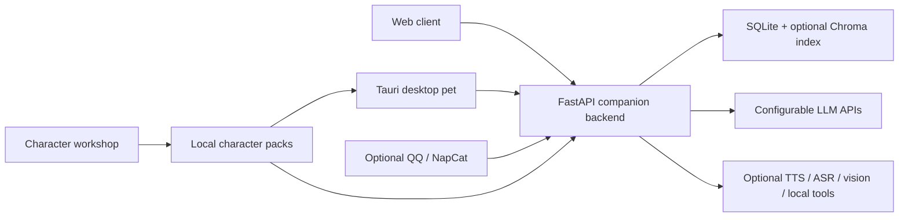

# AkaneCompanionLab

> **v0.1.0-alpha.1 / 学习与研究预览**
>
> 项目仍有已知缺陷，不建议用于生产环境。Windows 已提供可重复执行的
> 首次准备与单入口启动；桌宠安装包、Linux/macOS 桌面端仍未作为正式
> 发行物提供。

AkaneCompanionLab 是一个桌面陪伴角色系统：FastAPI 后端、静态 Web 客户端、
Windows-first 的 Tauri 桌宠，以及一个能让你做自己角色的角色工坊。

它想做的不是"更聪明的问答 AI"，而是让你和一个角色一起把相处过成日常。下面
几点是它和"套壳 chatbot"不一样的地方——每一条都能在代码里对上号，没做完的
不写进来。

## 它不太一样的地方

**分层记忆，而且记得"什么时候"。** 对话分三层沉淀：最近的原话、压缩后的阶段
摘要、再到长期语义记忆（你是谁、你反复提到的人和事、还没了结的约定）。长期
记忆不是一张扁平的事实表，它保留时间范围，反复出现的事会被"加固"。这三层都会
进入回复前的提示词，让她记得的旧事是带着"什么时候"的。

**角色能表达什么，由你给的资源决定。** 表情、服装、场景、BGM 都来自运行时的
资源清单。模型每轮只在"当前有哪些可选"里挑，输出后还会被归一化到真实存在的
资源，不会凭空写一个不存在的表情。删掉一个表情，她就真的露不出那个情绪；加
一首歌，你们就多一段能一起听的。

**一次回复是一份"表现"，不只是一段文字。** 同一轮结构化输出里同时带着：说
什么、分段气泡、什么表情、要不要播某段语音或音乐、关系状态怎么变，一起驱动
桌宠的脸、气泡、TTS 和音乐。

**角色是你的。** 角色工坊能创建或导入角色：配人设、上传立绘并校准、随时切换。
角色包会同时进入身份提示词、表情资源，和按角色隔离的记忆——换角色换的是一
整套记忆和她能感知的世界，不只是换张头像。Akane 是项目自带的默认演示角色。

**工具调用会校验、执行、把结果喂回来。** 模型想用工具时先校验，参数错或工具
不存在会把可读原因喂回去让它重试；执行成功后把结果带进下一轮。一轮一个工具，
多步靠多轮，高风险动作会要求确认——不是"说一句我做了"就算数。

**一套后端，多个端。** Web、桌宠、QQ 共用同一个回合引擎，但每个端按自己的模式
裁剪表现和可用工具（比如 QQ 端只发文字、语音和表情图片，不渲染立绘、场景和
BGM）。

## 当前状态

| 项目 | 状态 |
| --- | --- |
| FastAPI 后端 | 可用于本地学习和实验 |
| Web 客户端 | 可运行，部分资源需要自行提供 |
| Tauri 桌宠 | Alpha，主要在 Windows/WebView2 验证 |
| 角色工坊 | Alpha |
| QQ / NapCat | 可选，默认关闭 |
| TTS / ASR / 视觉 / 本地工具 | 可选，依赖外部服务或本机工具 |
| Windows 一键准备/启动 | 可用，首次需配置一次 LLM |
| 安装包 | 暂未提供；共享用户数据目录已完成，仍需打包后端运行时 |

未实现能力应返回明确状态，不会为了演示而伪装成功。详细桌宠状态见
`desktop_pet_next/README.md`。

## 架构概览



仓库按源码、工具、文档和本地私有材料分层：

- `companion_v01/`：FastAPI 后端和 Akane 运行时模块
- `services/`：共享服务客户端
- `web/`：后端直接 serve 的静态 Web 前端
- `desktop_pet/`：旧 Electron 桌宠 V0，冻结保留
- `desktop_pet_next/`：Tauri/WebView2 桌宠主线
- `desktop_pet_creator_kit/`：角色包创建工具
- `tests/`：测试套件
- `docs/` / `documents/`：工程文档、设计文档和项目资料
- `scripts/` / `maintenance/`：可共享开发工具和运维脚本
- `local_research/`：本地私有语料、抽取产物、临时研究资料，已被 Git 忽略

更详细的布局说明见 `docs/repository_layout.md`。

## Windows 一键启动

### 需要安装什么

有两种模式，按需选择：

**Web 模式（推荐新用户）**：只需要 Python，用浏览器访问。

| 软件 | 版本 | 下载地址 |
| --- | --- | --- |
| Python | 3.11 或更高 | [python.org/downloads](https://www.python.org/downloads/) |

安装时勾选 **”Add Python to PATH”**，否则脚本找不到 Python。

**Desktop 模式**：在 Web 模式基础上再安装 Node.js 和 Rust，才能构建和运行桌宠窗口。

| 软件 | 版本 | 下载地址 |
| --- | --- | --- |
| Python | 3.11 或更高 | [python.org/downloads](https://www.python.org/downloads/) |
| Node.js | LTS 版（≥18） | [nodejs.org](https://nodejs.org/) |
| Rust | 最新稳定版 | [rustup.rs](https://rustup.rs/)（按提示安装 rustup） |

Node.js 建议选 **”为所有用户安装”选项**，否则 npm 可能遇到权限问题。

---

### 启动步骤

1. 安装好上方所需软件后，双击 **`启动_Akane.bat`**。
2. 第一次运行会自动创建 `.venv`、安装 Python 依赖并生成 `.env`（大约 3–10 分钟）。
3. 如果安装了 Node.js + Rust，会自动构建桌宠（首次约 10–20 分钟）；否则自动回落 Web 模式在浏览器打开。
4. 弹出设置页后选择 LLM 服务商、填入 API Key，保存即可使用。

之后日常使用只需要双击同一个文件。

可视配置支持 OpenAI、DeepSeek、Google Gemini、Anthropic、Ollama 和其他
OpenAI 兼容服务。保存后的密钥位于被 Git 忽略的
`%LOCALAPPDATA%\Akane\users_data\_local\model_service.json`，读取接口只返回 `hasApiKey`，不会把
密钥回传到前端。

角色包、记忆、桌宠状态和运行日志统一保存在 `%LOCALAPPDATA%\Akane\`。
高级部署可用 `AKANE_DATA_ROOT` 指定其他绝对目录。

---

### 启动模式说明

`启动_Akane.bat` 默认使用 `Auto` 模式：

- 源码目录已有本机构建产物时，直接启动桌宠和后端。
- 环境具备 Node.js 与 Rust 时，自动构建并启动 Tauri 桌宠。
- 工具链不完整时，自动启动后端并在浏览器打开 Web 客户端。

也可以明确选择：

```powershell
.\start_akane.bat -Mode Web
.\start_akane.bat -Mode Desktop
```

只准备环境或只做诊断：

```powershell
powershell -NoProfile -ExecutionPolicy Bypass `
  -File .\scripts\bootstrap_akane_windows.ps1 -PrepareOnly

powershell -NoProfile -ExecutionPolicy Bypass `
  -File .\scripts\bootstrap_akane_windows.ps1 -CheckOnly -Mode Web
```

---

### 第一次启动耗时说明

终端会打印 `[INFO] / [OK] / [WARN] / [FAIL]` 状态行。看到 `Compiling …`、
`Downloading …`、`Resolving …` 是正常的下载和编译过程，不是报错。

| 阶段 | 说明 | 首次耗时 |
| --- | --- | --- |
| Python 依赖安装 | `Installing Python dependencies…` | 3–10 分钟（取决于网速） |
| npm install（Desktop 模式） | `Running npm install…` | 1–5 分钟 |
| Tauri 桌宠构建（Desktop 模式） | cargo 编译，输出大量 `Compiling …` | 10–20 分钟（首次） |
| 后端启动 | `Starting backend with: …` | 10–60 秒（首次初始化数据库） |
| 启动完成 | 弹出浏览器或桌宠窗口 | — |

---

### 常见问题

**pip 下载卡住或失败（国内网络）**

启动器读取 `AKANE_PIP_INDEX_URL` 或 `PIP_INDEX_URL`，可在 PowerShell 里临时
指定镜像：

```powershell
$env:AKANE_PIP_INDEX_URL = “https://pypi.tuna.tsinghua.edu.cn/simple”
.\启动_Akane.bat
```

**npm install 报权限错误（EPERM/-4048）**

通常发生在 Node.js 以”为所有用户安装”方式安装后以普通用户运行。启动器已内置
绕过方案，会将 npm 全局前缀重定向到用户目录。如果仍然报错，可以尝试以管理员
身份运行 `启动_Akane.bat`。

**桌宠模式报 Tauri CLI not found**

这是因为上一次 `npm install` 中断，留下了不完整的 `node_modules`。启动器会自动
检测并重新安装；如果手动删除 `desktop_pet_next/node_modules/` 后重新启动也能解决。

**后端启动失败（Backend did not become healthy）**

后端崩溃时，错误信息会直接打印在终端里（最后 30 行）。也可以查看完整日志：

- `%LOCALAPPDATA%\Akane\logs\akane_backend.log`（启动输出）
- `%LOCALAPPDATA%\Akane\logs\akane_backend.err.log`（错误详情）

**语义记忆 / HuggingFace 模型**

默认不会在启动时联网下载 HuggingFace 模型，失败时自动回退到本地 hashed
embedding。想启用 `BAAI/bge-m3` 语义模型时编辑 `.env`：

```dotenv
EMBEDDING_PROVIDER=auto
EMBEDDING_LOCAL_FILES_ONLY=false
HF_ENDPOINT=https://hf-mirror.com
```

---

### 其他说明

- 默认后端监听 `http://127.0.0.1:9999`。端口已被 Akane 占用时会自动重启；被
  未知进程占用时会提示手动释放或加 `-SkipBackend`。
- 模型 API Key 保存在
  `%LOCALAPPDATA%\Akane\users_data\_local\model_service.json`（Git 忽略，不会
  进入公开导出）。

## 平台与客户端边界

| 能力 | Windows | Linux | macOS |
| --- | --- | --- | --- |
| FastAPI 后端 | 主要验证平台 | 源码可运行，需手动安装 | 源码可运行，需手动安装 |
| 浏览器 Web 客户端 | 支持 | 随后端使用 | 随后端使用 |
| Tauri 桌宠/角色工坊 | Alpha，Windows-first | 未承诺 | 未承诺 |
| QQ / NapCat | 可选 | 取决于外部 NapCat 环境 | 取决于外部 NapCat 环境 |
| Windows 系统音乐/窗口感知 | 支持或结构化降级 | 不支持 | 不支持 |

当前“多端”指 Web、Windows 桌宠和 QQ 共享同一后端与角色包协议，不表示
每个桌面系统已经拥有同等完成度的原生客户端。

项目不捆绑本地大模型。云端 API 是最低硬件要求最低的路径；本地推理通过
Ollama 等外部服务接入，速度和效果取决于用户选择的模型、显存和量化方式。

源码 Alpha 与真正桌面安装包之间的阻塞项见
`docs/open_source_readiness_v1.md`。高级能力开源前的产品化验收表见
`docs/productization_release_gate_v1.md`；GPT-SoVITS、MCP、音乐等能力只有在
通过对应验收项后，才应作为公开宣传的完成能力。

## 最小后端安装

建议使用 Python 3.11。基础后端不要求 Rust、Node、QQ、CUDA 或本地
Embedding 模型。

### Windows PowerShell

```powershell
python -m venv .venv
.\.venv\Scripts\python.exe -m pip install -r requirements.txt
Copy-Item .env.example .env
```

服务器部署可以继续编辑 `.env` 设置 LLM；本地浏览器也可以打开设置面板完成
同样的模型配置。最小部署可保留：

```dotenv
EMBEDDING_PROVIDER=hashed
ENABLE_VECTOR_MEMORY=false
QQ_BRIDGE_ENABLED=false
```

启动默认后端：

```powershell
.\.venv\Scripts\python.exe launch_akane_memory_v01.py
```

默认后端地址为 `http://127.0.0.1:9999`。

### Linux / macOS 后端

后端设计为跨平台运行，但桌宠并未承诺跨平台可用：

```bash
python3 -m venv .venv
./.venv/bin/python -m pip install -r requirements.txt
cp .env.example .env
./.venv/bin/python launch_akane_memory_v01.py
```

旧的 Web 预览和 Electron 桌宠入口仅为兼容保留。新用户使用
`启动_Akane.bat`，桌宠主线为 `desktop_pet_next`。

## 桌宠模式

桌宠是 Akane 的桌面客户端，不是新的后端。它共享
`profile_user_id=master`，但使用独立 `session_id`。当前主线依赖
Tauri/WebView2，并以 Windows 为主要验证平台。

普通用户通过 `启动_Akane.bat` 自动启动后端和桌宠。开发调试入口见
`desktop_pet_next/README.md`。

## 本地访问

- 默认后端：`http://127.0.0.1:9999`
- 默认后端健康检查：`http://127.0.0.1:9999/health`
- Web 主界面：`http://127.0.0.1:9999/`
- 资源预览：`http://127.0.0.1:9999/resource-preview`

## 测试

推荐每次大改前先跑这条快速回归命令：

```powershell
python -m unittest tests.quick_regression_suite
```

如果你在 Windows 上更习惯脚本入口，也可以直接跑：

```powershell
powershell -ExecutionPolicy Bypass -File .\run_quick_regression.ps1
```

QQ 工坊能力和本机依赖自检：

```powershell
powershell -ExecutionPolicy Bypass -File .\run_qq_workshop_self_check.ps1
```

能力路网说明见 `docs/qq_workshop_capabilities_v1.md`。

这组快速套件会优先检查：

- `tests/test_resource_visibility_contract.py`
  - 附件区 / 生成区 / 任务工作区边界
  - 图片视觉卡、媒体规格卡、端到端资源可见性链路
- 附件歧义确认
- 生成文件歧义确认
- 精确 handle 发送不会被歧义目标干扰

完整回归仍然建议再跑一轮：

```powershell
python -m unittest discover tests
```

桌宠主线验证：

```powershell
npm --prefix desktop_pet_next ci
npm --prefix desktop_pet_next run verify:control-center
cargo check --manifest-path desktop_pet_next/src-tauri/Cargo.toml
git diff --check
```

## 使用 AI 协助部署

可以让 AI 编程助手先阅读 `README.md` 和
`desktop_pet_next/README.md`，再根据本机环境执行安装与诊断。请始终：

- 自己确认命令作用后再授权执行
- 不把真实 `.env`、API Key、Cookie、聊天数据库或私人角色包发给模型
- 不允许助手用假结果代替缺失依赖
- 先运行后端和 `npm run doctor`，再排查桌宠问题
- 保留 `QQ_BRIDGE_ENABLED=false`，除非明确配置了 NapCat

## 公开发布与素材

本开发目录可能包含仅供本地开发使用、尚未确认再分发权的媒体资源。不要
直接把当前 Git 历史设为公开仓库。请使用安全导出：

```powershell
powershell -NoProfile -ExecutionPolicy Bypass `
  -File .\scripts\export_public_alpha.ps1
```

导出结果不包含原 Git 历史、用户数据、音乐、Live2D 样例和授权不明媒体。
默认角色 Akane（`akane_v1`）的立绘作为可分发的演示素材随包发布；其余需要
图片的位置用中性占位图维持学习和构建路径。详见：

- `ASSETS_LICENSE.md`
- `THIRD_PARTY_NOTICES.md`
- `PUBLIC_RELEASE.md`
- `docs/productization_release_gate_v1.md`

## 角色与自定义

- 项目自带 Akane（`akane_v1`）作为默认演示角色，克隆后开箱即用。
- 角色不是写死的。你可以在角色工坊里创建或导入自己的角色：配置人设、
  上传并校准立绘、快速切换；每个角色的记忆默认隔离。Akane 只是示范。
- `web/assets/` 是项目自有资源，不与其它仓库互相覆盖。

## 可选：音频分离环境

`separate_audio_stems`（人声/伴奏分离）和 `clean_voice_track`（AI 人声净化）是
可选工具，需要本地音频模型环境（`ffmpeg` + `torch` + `demucs` + `deepfilternet`），
默认不开。要用 NVIDIA GPU，关键是装 **CUDA 版 PyTorch**（不是 CPU 版）：

```powershell
# 先卸掉 CPU 版，再按 PyTorch 官方矩阵装 CUDA 版（下面是 CUDA 12.8 示例）
python -m pip uninstall -y torch torchvision torchaudio
python -m pip install torch torchvision torchaudio --index-url https://download.pytorch.org/whl/cu128
python -m pip install -U demucs
```

PyTorch 官方安装入口：<https://pytorch.org/get-started/locally/>

验证：`torch.cuda.is_available()` 返回 `True`、且 `python -m demucs.separate --help`
能正常跑，环境即就绪。

## 许可证

除非文件另有说明，项目有权授权的源码、脚本、测试和原创技术文档采用
Apache License 2.0。

角色、美术、场景、音频、Live2D 模型、商标和第三方素材不自动包含在
Apache-2.0 授权中。参见 `LICENSE`、`NOTICE`、`ASSETS_LICENSE.md` 和
`THIRD_PARTY_NOTICES.md`。
