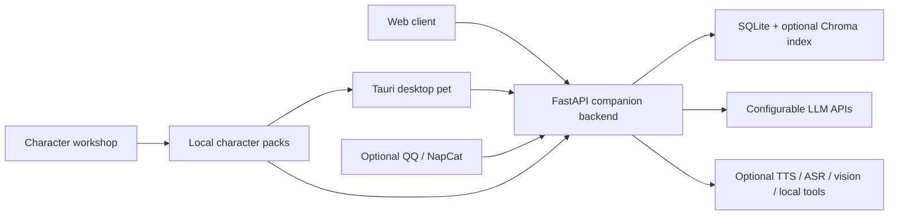

# AkaneCompanionLab

> **v0.1.0-alpha.1 / 学习与研究预览**
>
> 项目仍有已知缺陷，不建议用于生产环境。Windows 已提供可重复执行的
> 首次准备与单入口启动；桌宠安装包、Linux/macOS 桌面端仍未作为正式
> 发行物提供。

AkaneCompanionLab 是一个实验性的陪伴角色系统，包含 FastAPI 后端、静态
Web 客户端、Windows-first Tauri 桌宠、角色工坊和可选的本地能力集成。

## 当前状态

| 项目 | 状态 |
| --- | --- |
| FastAPI 后端 | 可用于本地学习和实验 |
| Web 客户端 | 可运行，部分资源需要自行提供 |
| Tauri 桌宠 | Alpha，主要在 Windows/WebView2 验证 |
| 角色工坊 | Alpha |
| QQ / NapCat | 可选，默认关闭 |
| TTS / ASR / 视觉 / 本地工具 | 可选，依赖外部服务或本机工具 |
| Windows 一键准备/启动 | 可用，首次需配置一次 LLM |
| 安装包 | 暂未提供；共享用户数据目录已完成，仍需打包后端运行时 |

未实现能力应返回明确状态，不会为了演示而伪装成功。详细桌宠状态见
`desktop_pet_next/README.md`。

## 架构概览


```mermaid
flowchart LR
    Web[Web client] --> API[FastAPI companion backend]
    Pet[Tauri desktop pet] --> API
    QQ[Optional QQ / NapCat] --> API
    API --> Memory[SQLite + optional Chroma index]
    API --> LLM[Configurable LLM APIs]
    API --> Optional[Optional TTS / ASR / vision / local tools]
    Creator[Character workshop] --> Packs[Local character packs]
    Packs --> Pet
    Packs --> API
```

仓库按源码、工具、文档和本地私有材料分层：

- `companion_v01/`：FastAPI 后端和 Akane 运行时模块
- `services/`：共享服务客户端
- `web/`：后端直接 serve 的静态 Web 前端
- `desktop_pet/`：旧 Electron 桌宠 V0，冻结保留
- `desktop_pet_next/`：Tauri/WebView2 桌宠主线
- `desktop_pet_creator_kit/`：角色包创建工具
- `tests/`：测试套件
- `docs/` / `documents/`：工程文档、设计文档和项目资料
- `scripts/` / `maintenance/`：可共享开发工具和运维脚本
- `local_research/`：本地私有语料、抽取产物、临时研究资料，已被 Git 忽略

更详细的布局说明见 `docs/repository_layout.md`。

## Windows 一键启动

普通使用者从这里开始：

1. 安装 Python 3.11 或更高版本，并在安装器中启用 `Add Python to PATH`。
2. 双击 `启动_Akane.bat`。
3. 第一次运行会自动创建 `.venv`、安装 Python 依赖并生成高级配置用的
   `.env`。
4. 如果尚未配置模型，桌面端会自动打开控制中心的“模型”页；Web 回退模式
   会自动展开模型设置。选择服务商、检测模型、测试 API，再保存即可。

之后日常使用只需要双击同一个文件。

可视配置支持 OpenAI、DeepSeek、Google Gemini、Anthropic、Ollama 和其他
OpenAI 兼容服务。保存后的密钥位于被 Git 忽略的
`%LOCALAPPDATA%\Akane\users_data\_local\model_service.json`，读取接口只返回 `hasApiKey`，不会把
密钥回传到前端。`.env` 继续作为服务器部署和 CHAT/AUX/TEXT/VISION 高级分工
的入口。

角色包、记忆、桌宠状态和运行日志也统一保存在
`%LOCALAPPDATA%\Akane\`。首次通过启动器运行时，旧源码目录中的本地数据只会
复制到新目录中缺失的位置；不会删除旧文件，也不会覆盖新目录中已有的内容。
高级部署可用 `AKANE_DATA_ROOT` 指定其他绝对目录。

启动器默认使用 `Auto` 模式：

- 当前源码目录已有本机构建产物时，直接启动桌宠和后端。
- 源码环境具备 Node.js 与 Rust 时，自动构建并启动 Tauri 桌宠。
- 桌宠工具链不完整时，自动启动后端并在浏览器打开 Web 客户端。

也可以明确选择客户端：

```powershell
.\start_akane.bat -Mode Web
.\start_akane.bat -Mode Desktop
```

只准备环境或只做诊断：

```powershell
powershell -NoProfile -ExecutionPolicy Bypass `
  -File .\scripts\bootstrap_akane_windows.ps1 -PrepareOnly

powershell -NoProfile -ExecutionPolicy Bypass `
  -File .\scripts\bootstrap_akane_windows.ps1 -CheckOnly -Mode Web
```

首次依赖安装可能需要数分钟。启动失败会给出缺少的 Python、Node、Rust
或配置项，不会把未启动的能力显示成成功。

## 平台与客户端边界

| 能力 | Windows | Linux | macOS |
| --- | --- | --- | --- |
| FastAPI 后端 | 主要验证平台 | 源码可运行，需手动安装 | 源码可运行，需手动安装 |
| 浏览器 Web 客户端 | 支持 | 随后端使用 | 随后端使用 |
| Tauri 桌宠/角色工坊 | Alpha，Windows-first | 未承诺 | 未承诺 |
| QQ / NapCat | 可选 | 取决于外部 NapCat 环境 | 取决于外部 NapCat 环境 |
| Windows 系统音乐/窗口感知 | 支持或结构化降级 | 不支持 | 不支持 |

当前“多端”指 Web、Windows 桌宠和 QQ 共享同一后端与角色包协议，不表示
每个桌面系统已经拥有同等完成度的原生客户端。

项目不捆绑本地大模型。云端 API 是最低硬件要求最低的路径；本地推理通过
Ollama 等外部服务接入，速度和效果取决于用户选择的模型、显存和量化方式。

源码 Alpha 与真正桌面安装包之间的阻塞项见
`docs/open_source_readiness_v1.md`。高级能力开源前的产品化验收表见
`docs/productization_release_gate_v1.md`；GPT-SoVITS、MCP、音乐等能力只有在
通过对应验收项后，才应作为公开宣传的完成能力。

## 最小后端安装

建议使用 Python 3.11。基础后端不要求 Rust、Node、QQ、CUDA 或本地
Embedding 模型。

### Windows PowerShell

```powershell
python -m venv .venv
.\.venv\Scripts\python.exe -m pip install -r requirements.txt
Copy-Item .env.example .env
```

服务器部署可以继续编辑 `.env` 设置 LLM；本地浏览器也可以打开设置面板完成
同样的模型配置。最小部署可保留：

```dotenv
EMBEDDING_PROVIDER=hashed
ENABLE_VECTOR_MEMORY=false
QQ_BRIDGE_ENABLED=false
```

启动默认后端：

```powershell
.\.venv\Scripts\python.exe launch_akane_memory_v01.py
```

默认后端地址为 `http://127.0.0.1:9999`。

### Linux / macOS 后端

后端设计为跨平台运行，但桌宠并未承诺跨平台可用：

```bash
python3 -m venv .venv
./.venv/bin/python -m pip install -r requirements.txt
cp .env.example .env
./.venv/bin/python launch_akane_memory_v01.py
```

旧的 Web 预览和 Electron 桌宠入口仅为兼容保留。新用户使用
`启动_Akane.bat`，桌宠主线为 `desktop_pet_next`。

## 桌宠模式

桌宠是 Akane 的桌面客户端，不是新的后端。它共享
`profile_user_id=master`，但使用独立 `session_id`。当前主线依赖
Tauri/WebView2，并以 Windows 为主要验证平台。

普通用户通过 `启动_Akane.bat` 自动启动后端和桌宠。开发调试入口见
`desktop_pet_next/README.md`。

## 本地访问

- 默认后端：`http://127.0.0.1:9999`
- 默认后端健康检查：`http://127.0.0.1:9999/health`
- Web 主界面：`http://127.0.0.1:9999/`
- 资源预览：`http://127.0.0.1:9999/resource-preview`

## 测试

推荐每次大改前先跑这条快速回归命令：

```powershell
python -m unittest tests.quick_regression_suite
```

如果你在 Windows 上更习惯脚本入口，也可以直接跑：

```powershell
powershell -ExecutionPolicy Bypass -File .\run_quick_regression.ps1
```

QQ 工坊能力和本机依赖自检：

```powershell
powershell -ExecutionPolicy Bypass -File .\run_qq_workshop_self_check.ps1
```

能力路网说明见 `docs/qq_workshop_capabilities_v1.md`。

这组快速套件会优先检查：

- `tests/test_resource_visibility_contract.py`
  - 附件区 / 生成区 / 任务工作区边界
  - 图片视觉卡、媒体规格卡、端到端资源可见性链路
- 附件歧义确认
- 生成文件歧义确认
- 精确 handle 发送不会被歧义目标干扰

完整回归仍然建议再跑一轮：

```powershell
python -m unittest discover tests
```

桌宠主线验证：

```powershell
npm --prefix desktop_pet_next ci
npm --prefix desktop_pet_next run verify:control-center
cargo check --manifest-path desktop_pet_next/src-tauri/Cargo.toml
git diff --check
```

## 使用 AI 协助部署

可以让 AI 编程助手先阅读 `README.md`、`AGENTS.md` 和
`desktop_pet_next/README.md`，再根据本机环境执行安装与诊断。请始终：

- 自己确认命令作用后再授权执行
- 不把真实 `.env`、API Key、Cookie、聊天数据库或私人角色包发给模型
- 不允许助手用假结果代替缺失依赖
- 先运行后端和 `npm run doctor`，再排查桌宠问题
- 保留 `QQ_BRIDGE_ENABLED=false`，除非明确配置了 NapCat

## 公开发布与素材

本开发目录可能包含仅供本地开发使用、尚未确认再分发权的媒体资源。不要
直接把当前 Git 历史设为公开仓库。请使用安全导出：

```powershell
powershell -NoProfile -ExecutionPolicy Bypass `
  -File .\scripts\export_public_alpha.ps1
```

导出结果不包含原 Git 历史、用户数据、音乐、Live2D 样例和授权不明媒体，
并使用中性占位图维持学习和构建路径。详见：

- `ASSETS_LICENSE.md`
- `THIRD_PARTY_NOTICES.md`
- `PUBLIC_RELEASE.md`
- `docs/productization_release_gate_v1.md`

## 说明

- 当前主界面已经切到通用 gal 壳，前端不再绑定某个固定人物。
- `web/assets/` 保持项目自有资源，不与其它仓库互相覆盖。
- 这个目录后续用于网页前端版本，不再和旧 `AkaneBrain` 主工程混改。

## 可选：音频分离环境

如果你希望 Akane 使用 `separate_audio_stems` 做人声 / 伴奏分离，或使用 `clean_voice_track` 做 AI 人声净化，需要额外准备本地音频模型环境。

当前项目默认只依赖：

- `ffmpeg`
- `torch`
- `demucs`
- `deepfilternet`

但要真正吃到 NVIDIA GPU，需要确保：

1. 你的机器能正常看到显卡
   - `nvidia-smi`
2. 当前 Python 环境安装的是 **CUDA 版 PyTorch**，而不是 CPU 版
3. `demucs` 命令或 `python -m demucs.separate` 可以执行

### Windows / NVIDIA 推荐流程

先卸掉当前环境里的 CPU 版 PyTorch：

```powershell
python -m pip uninstall -y torch torchvision torchaudio
```

然后按 PyTorch 官方安装矩阵选择 **Windows + Pip + Python + CUDA** 对应命令安装。

官方入口：

- PyTorch Start Locally: https://pytorch.org/get-started/locally/

对于支持 CUDA 12.8 的 Windows / NVIDIA 机器，一般会是类似下面这种形式：

```powershell
python -m pip install torch torchvision torchaudio --index-url https://download.pytorch.org/whl/cu128
```

再安装 Demucs：

```powershell
python -m pip install -U demucs
```

### 验证

```powershell
python -c "import torch; print(torch.__version__); print(torch.cuda.is_available()); print(torch.cuda.device_count())"
python -m demucs.separate --help
```

只要 `torch.cuda.is_available()` 返回 `True`，并且 `demucs` 能正常显示帮助信息，Akane 的音频分离工具环境就算准备好了。

## 许可证

除非文件另有说明，项目有权授权的源码、脚本、测试和原创技术文档采用
Apache License 2.0。

角色、美术、场景、音频、Live2D 模型、商标和第三方素材不自动包含在
Apache-2.0 授权中。参见 `LICENSE`、`NOTICE`、`ASSETS_LICENSE.md` 和
`THIRD_PARTY_NOTICES.md`。
