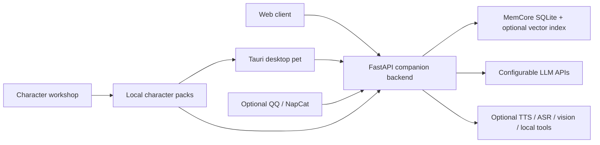

# AkaneCompanionLab

> **v0.1.0-alpha.1 / Learning and research preview**
>
> This project is currently an Alpha preview with known limitations and is not recommended for production environments. Windows provides a repeatable first-run bootstrap and a single unified launcher. Desktop installer packages and native Linux/macOS desktop clients are not yet provided as official release artifacts.

AkaneCompanionLab is a desktop companion-character system featuring a FastAPI backend, a static Web client, a Windows-first Tauri desktop pet, and an interactive Character Workshop for crafting custom characters.

It is designed not merely as another "clever Q&A chatbot", but as a companion who shares your daily life. Below are the key characteristics that set it apart from ordinary chatbot wrappers—every single one is backed by working code, leaving out unfinished promises.

## What Makes It Different

**Unified Timeline memory that truly remembers "what happened."** Ordinary conversations, group chat dialogues, structured environment events, tool invocations/observations, and final responses all flow into a single unified MemCore Unified Timeline V2. Turns share a stable `turn_id`, while parallel tools pair with dedicated `correlation_id`s. Dialogue naturally settles into episodic summaries and long-term semantic memories without severing full tool branches. Both synchronous and streaming LLM calls preserve authentic provider-native responses and reconstruct subsequent turns via provider-native projection, never faking history with re-serialized JSON. See design highlights and integration contracts in [`docs/memcore_unified_timeline_v2_integration.md`](docs/memcore_unified_timeline_v2_integration.md).

**What the character can express is bounded by runtime resources.** Expressions, outfits, scenes, and BGM all come from an authoritative runtime resource manifest. Each turn, the model selects only from currently available assets, and outputs are strictly normalized against real files—the model cannot hallucinate a non-existent expression. Delete an expression, and she genuinely cannot show that emotion; add a song, and you have one more melody to enjoy together.

**A reply is a multi-modal "performance," not just plain text.** A single structured output carries it all at once: dialogue text, segmented speech bubbles, facial expressions, voice clip/BGM playback triggers, and evolving relationship states—harmoniously driving the pet's portrait, floating bubble, TTS voice, and background music.

**The character is genuinely yours.** The Character Workshop lets you create or import custom characters: configure persona prompts, upload and calibrate portraits, and switch seamlessly at runtime. Switching a character swaps their identity prompts, expression resources, and character-isolated memory—changing the character changes the entire world she perceives, not just an avatar. Akane is the bundled default demo character.

**Tool calls are validated, executed, and fed back in closed loop.** When the model invokes a tool, arguments are strictly validated; invalid parameters or missing tools feed back human-readable diagnostics so the model can correct itself; successful executions feed real observations into subsequent turns. One tool per round, complex tasks across multi-turn chains, and high-risk operations demand explicit user confirmation—no "pretending to have done it."

**Skills on-demand loading & model self-authoring hot reload.** The ambient prompt context only holds stable Skill names and activation scenarios. When a task matches, the full `SKILL.md`, references, or executable scripts are loaded dynamically via tools. Scripts reuse the existing Shell runtime, and execution traces seamlessly enter MemCore's tool timeline. Furthermore, the master can instruct the companion to draft, validate, and atomically publish new Skills right inside the execution workspace—taking effect on the very next model turn without restarting the backend. Contract and permission boundaries are documented in [`docs/akane_skills_hot_reload_v1.md`](docs/akane_skills_hot_reload_v1.md).

**One unified backend, multiple front-ends.** Web, desktop pet, and QQ share the same underlying turn engine, but each client adapts presentation and tool capabilities to its native environment (for example, QQ only transmits text, voice messages, and sticker images, omitting full-body portrait rendering, scenes, and BGM).

**Immersive Scene & Stories ("片刻小屋").** Beyond floating on the desktop corner, the companion can expand into a full immersive room window. Experience dynamic day/night background shifts, interactive dialogues, and multi-act visual stories. Creators can write interactive stories in intuitive Markdown syntax without writing code (see [`docs/story_markdown_guide.md`](docs/story_markdown_guide.md)).

**Safe, controllable Computer Use & browser synergy.** Leveraging native Tauri device control on Windows, the companion can observe, locate, and interact with desktop windows under safe control leases, foreground handoff, and explicit user preference switches. It also integrates an optional personal Chrome adapter for web browsing and retrieval.

## Current Status

| Component | Status | Description |
| --- | --- | --- |
| FastAPI Backend | Usable | For local learning, research, and experimentation |
| Web Client | Usable | Fully functional; public export bundles default Akane assets |
| Tauri Desktop Pet | Alpha | Primarily tested and verified on Windows / WebView2 |
| Immersive Scene & Stories ("片刻小屋") | Alpha | Interactive room, day/night lighting, and multi-act Markdown story player |
| Computer Use | Alpha | Windows native device control and Chrome bridge under safe leases |
| Character Workshop | Alpha | Create, calibrate, and import custom characters |
| QQ / NapCat | Optional | Disabled by default; requires external NapCat/OneBot deployment |
| TTS / ASR / Vision / Local Tools | Optional | Integrates external providers or local command utilities |
| Windows Bootstrap / Single Launcher | Ready | Auto-prepares `.venv`, dependencies, and first-run LLM config |
| Packaged Installer | Pending | Shared per-user data root complete; backend runtime packaging in progress |

Unimplemented features return clear error statuses rather than faking success for demos. Detailed desktop pet status is tracked in `desktop_pet_next/README.md`.

## Architecture Overview



The repository separates source, tools, documentation, and local private data:

- `companion_v01/`: FastAPI backend and core Akane runtime modules
- `services/`: Shared service clients
- `web/`: Static Web client served directly by the backend
- `desktop_pet/`: Legacy Electron desktop pet V0 (frozen for reference)
- `desktop_pet_next/`: Mainline Tauri / WebView2 desktop pet
- `desktop_pet_creator_kit/`: Character pack creation and calibration tools
- `tests/`: Comprehensive test suite
- `docs/` / `documents/`: Engineering docs, design specifications, and guides
- `scripts/` / `maintenance/`: Shared developer tooling and maintenance scripts
- `local_research/`: Local private corpus, scratchpads, and temporary research materials (Git-ignored)

Detailed repository layout is described in `docs/repository_layout.md`.

## Windows Quick Start

For standard users on Windows:

1. Install Python 3.11 or newer (ensure `Add Python to PATH` is checked in the installer).
2. Double-click `启动_Akane.bat`.
3. The first launch automatically sets up `.venv`, installs Python dependencies, and generates `.env` for advanced options.
4. If no LLM is configured yet, the desktop app automatically opens the Control Center "Model" page (or the Web fallback opens settings). Select your provider, detect models, test the API connection, and save.

After initial setup, simply double-click the same file for daily use.

To experience the full immersive scene window and story theater, double-click:

```text
启动_片刻小屋.bat
```

Legacy launch scripts (`start_akane_next.bat`, `start_akane_local_test.bat`, etc.) forward automatically to this single public entry.

Visual configuration supports OpenAI, DeepSeek, Google Gemini, Anthropic, Ollama, and other OpenAI-compatible endpoints. Saved API keys are stored in `%LOCALAPPDATA%\Akane\users_data\_local\model_service.json` (Git-ignored); API read endpoints only return `hasApiKey` and never expose plain secrets to the frontend.

Character packs, memories, desktop pet states, and runtime logs all reside in `%LOCALAPPDATA%\Akane\`. Advanced deployments can override this via the `AKANE_DATA_ROOT` environment variable.

The launcher defaults to `Auto` mode, targeting the desktop pet:
- When local build artifacts exist, it launches the desktop pet and backend immediately.
- On first run without build artifacts, if Node.js and Rust are detected, it builds and launches the Tauri pet automatically.
- If desktop prerequisites are missing, it reports the missing tools with clear instructions rather than silently falling back to Web.

You can explicitly choose the client:

```powershell
.\start_akane.bat -Mode Web
.\start_akane.bat -Mode Desktop
```

Lifecycle and diagnostics are managed via the same entry:

```powershell
.\start_akane.bat -Action Status   # Read-only check of backend, devices, and UI
.\start_akane.bat -Action Doctor   # Read-only diagnosis of instance flags
.\start_akane.bat -Action Stop     # Stop processes owned by this instance
.\start_akane.bat -Action Restart  # Explicit maintenance restart
```

### What Happens on First Launch

The first double-click of `启动_Akane.bat` proceeds through the following stages:

| Stage | What you see | Rough duration |
| --- | --- | --- |
| Python Environment | `Creating .venv with Python …` then `Installing Python dependencies…` | 3–8 min (network dependent) |
| Desktop Pet Dependencies | `desktop_pet_next/node_modules not found. Running npm install...` | 1–3 min |
| Tauri Desktop Build | `[首次构建提示]` block, then cargo compilation entries | 5–15 min (first build only) |
| Backend Readiness | `Starting backend with: …` / `Backend log: …` | seconds |
| Device Executor | `Desktop device executor PID: …` / `Desktop device executor is online …` | local tools connect or report status |
| Desktop Pet Readiness | `Starting Akane Next for instance …` / `Desktop UI is ready …` | state and input finish initializing |
| Model Configuration | Control Center "Model" page opens automatically | configure your LLM; active on save |

## Platform and Client Boundaries

| Surface | Windows | Linux | macOS |
| --- | --- | --- | --- |
| FastAPI Backend | Primary validation | Source-runnable (manual setup) | Source-runnable (manual setup) |
| Web Client | Supported | Supported | Supported |
| Tauri Desktop Pet / Workshop | Alpha, Windows-first | Not guaranteed | Not guaranteed |
| QQ / NapCat | Optional | Depends on external NapCat | Depends on external NapCat |
| Windows System Music / Window Sensing | Supported / structured degradation | Unsupported | Unsupported |

"Multi-front-end" signifies that Web, Windows desktop pet, and QQ share the same backend protocol; it does not promise equal native client maturity across all desktop operating systems.

The project does not bundle local LLMs. Cloud APIs offer the lowest hardware barrier; local inference via Ollama depends on user-selected models, VRAM, and quantization settings.

See `docs/open_source_readiness_v1.md` for installer release blockers and `docs/productization_release_gate_v1.md` for capability release gates.

## Minimal Backend Setup & Independent Packages

Python 3.11 is recommended. The minimal backend does not require Rust, Node.js, QQ, CUDA, or local embedding models.

### Independent Package Dependencies

Akane depends strictly on versioned release artifacts of its decoupled core packages (`requirements-packages.txt`), without relying on local source tree paths. Supported installation channels include:

- Bundled complete dependency closure in `package_wheels/`;
- Custom wheelhouse configured via `AKANE_PACKAGE_WHEELHOUSE` or `-PackageWheelhouse`;
- Standard package index configured via `AKANE_PACKAGE_INDEX_URL` or `-PackageIndexUrl`.

`memcore` serves as the primary conversation memory engine. Run the cross-package ecosystem smoke test to verify promptpack / charpack / memcore / capcore:

```powershell
.\.venv\Scripts\python.exe .\scripts\smoke_extracted_package_ecosystem.py
```

### Windows Manual PowerShell Setup

```powershell
python -m venv .venv
.\scripts\bootstrap_akane_windows.ps1 -PrepareOnly -PackageWheelhouse .\package_wheels
Copy-Item .env.example .env
```

Start the default backend:

```powershell
.\.venv\Scripts\python.exe launch_akane_memory_v01.py
```

Default backend URL: `http://127.0.0.1:9999`.

### Linux / macOS Backend

```bash
python3 -m venv .venv
./.venv/bin/python -m pip install --no-index --find-links ./package_wheels -r requirements.txt
cp .env.example .env
./.venv/bin/python launch_akane_memory_v01.py
```

## Testing & Verification

Repository validation centers on `scripts/verify_akane.ps1` as the single authoritative entry point. Daily modifications should run Quick tier in an isolated temporary environment:

```powershell
.\scripts\verify_akane.ps1 -Tier Quick
```

Before committing, run Full tier (aligned with Windows CI, covering Python, desktop pet build/smoke, Tauri test/fmt, export audit, and diff hygiene):

```powershell
.\scripts\verify_akane.ps1 -Tier Full
```

For real instance, port, or launcher lifecycle validation, execute Acceptance tier:

```powershell
.\scripts\verify_akane.ps1 -Tier Acceptance
```

## Public Release & Asset Sanitization

The private development repository must **never** be published directly, as past Git history may retain removed media or local-only assets. Generate a sanitized, history-free public snapshot via:

```powershell
powershell -NoProfile -ExecutionPolicy Bypass `
  -File .\scripts\export_public_alpha.ps1
```

The exporter strips private data, Git history, unlicensed audio, and Live2D test models. The default `akane_v1` character art ships as documented, redistributable demo assets; other asset slots generate neutral placeholder PNGs to preserve compilation paths.

See detailed legal and asset boundaries in:
- `ASSETS_LICENSE.md`
- `THIRD_PARTY_NOTICES.md`
- `PUBLIC_RELEASE.md`
- `docs/productization_release_gate_v1.md`

## 🌟 Making It More Fun Together (A Note from the Author)

To be completely honest, I’m not a senior tech lead or a veteran engineer—just an ordinary college student who loves anime and virtual companions. This project was born purely out of a passion to create an AI companion that truly feels like part of everyday life, built step-by-step alongside AI coding assistants through countless nights of experimentation.

Under the hood, I've done my best to engineer it with absolute care—ensuring memories don't get mixed up, tool calls execute reliably, and conversations preserve causal continuity. The underlying foundation is now running steadily.

However, **modern frontend design, complex visual animations, and UI art are genuinely not my strong suit.** Looking at the desktop pet in the corner of my screen, I always find myself dreaming up playful ideas:
- More expressive interactions and fluid movement feedback;
- Turning the "Immersive Room" into a richer scene with mini-games we can play together;
- Aesthetic lighting shifts, desktop widgets, and heartwarming interactive story scripts...

Bringing all these creative ideas to life with my own limited bandwidth is a daunting task. That’s why I’m opening this project to the world—**I believe there are many creators in the open-source community who share the same love for virtual companions.**

**Whether you are:**
- 🎨 **A Frontend / Motion Enthusiast**: Familiar with Vue, Tauri, PixiJS, or CSS animations, eager to elevate the visual experience and interactions;
- ⚙️ **A Python / Backend & Plugin Developer**: Akane features a native plugin system and open capability protocols—you can effortlessly write custom tools, integrate external APIs, connect smart home devices, gaming ecosystems, or bridge new models and hardware;
- 🎮 **A Storyteller**: Who loves crafting branching dialogue and interactive companion narratives using our simple Markdown format;
- 🖼️ **An Artist / Creator**: Interested in designing original character packs, expressive emotes, or cozy backgrounds;
- 💡 **An Idea Generator or Player**: Anyone who thinks, *"Wouldn't it be awesome if she could do this?"*

If you share the dream of having a living, soulful desktop companion, **you are warmly invited!** Opening an issue to brainstorm, writing a fun plugin, polishing a UI element, or contributing new features—everything is deeply appreciated. Let’s build something wonderful and heartwarming together!

## Optional: Audio Separation Environment

`separate_audio_stems` (voice/accompaniment separation) and `clean_voice_track` (AI voice purification) are optional tools requiring `ffmpeg` + `torch` + `demucs` + `deepfilternet`. For NVIDIA GPU acceleration, install CUDA-enabled PyTorch:

```powershell
python -m pip uninstall -y torch torchvision torchaudio
python -m pip install torch torchvision torchaudio --index-url https://download.pytorch.org/whl/cu128
python -m pip install -U demucs
```

Verify GPU availability via `torch.cuda.is_available()`.

## License

Source code, scripts, tests, and original technical documentation that the project has the right to license are available under the **Apache License 2.0**.

Artwork, character designs, scenes, audio, Live2D models, trademarks, and user-provided character packs are not automatically covered under Apache-2.0. Refer to `LICENSE`, `NOTICE`, `ASSETS_LICENSE.md`, and `THIRD_PARTY_NOTICES.md`.
