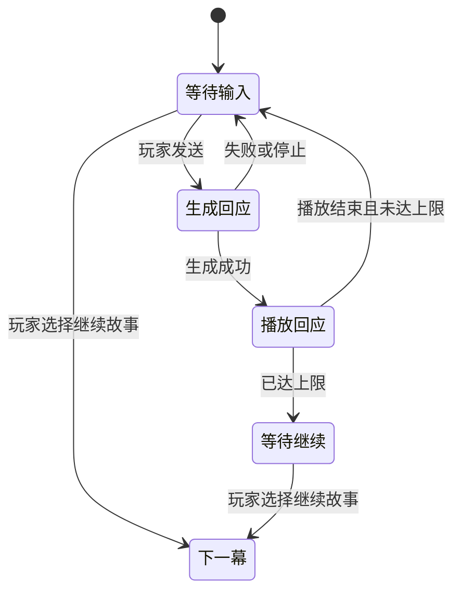

# 互动剧情与演出设计 V2

日期：2026-09-20 · 状态：评审稿，尚未执行。

本文承接现有片刻小屋，设计下一轮的用户体验、模块边界与实施顺序。文中的新增字段、事件和界面都是拟议设计，不代表已经实现。V2 是本轮设计及拟议剧本格式的版本；不要求立即替换现有逐句播放协议。

## 1. 这次要做出什么

让用户进入一个短故事后，可以看演出、聊几句、点一下完成真实互动，再自然回到日常。固定剧情给出情境，模型提供自然回应，宿主负责真实状态和推进规则。

第一份成品围绕“深夜送宵夜”，长度以 5–10 分钟为创作目标，不强行限制玩家停留时间。完成后，玩家应当能感受到：刚才做的选择和互动，确实影响了角色的回应与后续内容。

优先落地三件事：

1. 自由对话能聊多轮，玩家随时选择继续故事。
2. 选择和互动读取真实库存、装备与已完成故事，执行后产生真实结果。
3. 一幕中能安排少量声音、停顿和角色动作，让表演有节奏。

轻量创作预览放在上述体验跑通之后。技术栈继续使用 Vue 3、TypeScript、Pinia、Pixi 和 Tauri，宿主继续使用现有 Python 服务。

## 2. 当前基础与本轮增量

以下是本次源码对照的基线，不等同于完整桌面验收结论。

| 当前已有 | 本轮补充 |
| --- | --- |
| 按句播放、按句表情、点击与 AUTO、播放回执 | 对白前后可编排少量演出事件 |
| 固定台词、选择、单次 AI 回复、结局节点 | 可持续多轮的自由互动节点，以及明确的收尾规则 |
| 剧本背景、音乐、服装及默认设置 | 区分剧情临时装扮与真实装备，支持显式停止音乐 |
| 背景/表情渐变、呼吸与基础动作 | 有用途的入场、靠近、停顿、环境音和音效 |
| 真实购买、投喂、换装与动作事件 | 将真实动作接入剧情选择、条件和回应 |
| 剧本副本、当前节点与历史存档 | 节点访问次数、互动轮次、播放位置和待回应事实 |
| Markdown 剧本、资源导入、角色工坊 | 节点列表、属性编辑、当前节点试玩与清楚的错误提示 |

当前选择结构虽有 `condition` 字段，执行路径还没有相应的条件求值；当前 `agent` 节点生成一次回答后进入下一段。两者都需要实际调用链上的扩展。

## 3. 玩家看到的完整体验

### 3.1 样例：深夜送宵夜

| 段落 | 玩家看到/听到什么 | 玩家能做什么 | 宿主确认什么 |
| --- | --- | --- | --- |
| 日常入口 | 故事卡片说明“夜间小屋 · 约 5–10 分钟” | 主动进入；有进度则继续或重新开始 | 本次演出身份、剧本版本与进度 |
| 开场 | 轻敲门声、短暂停顿、角色出现；“还在忙吗？” | 点对白或使用 AUTO | 已展示的对白与已播放的音频 |
| 自由交谈 | 角色回应今天的经历，保持当前情境 | 输入、继续聊、继续故事 | 成功生成的轮次；实际展示进度 |
| 宵夜互动 | “你也要尝一口吗？”及清晰的动作卡 | 从口袋选择点心投喂；没有点心则跳过或去商店 | 有无库存、扣除数量、实际养成变化 |
| 结果回应 | 根据投喂成功、未投喂等事实给出不同反馈 | 看完反馈、继续 | 动作事实与回应分别记录 |
| 收尾 | 角色提醒休息；一句简短回顾 | 返回日常、查看记录 | 抵达结局与看完结局分别记录 |
| 回到日常 | 日常场景恢复；刚才真正消耗的物品仍已消耗 | 继续聊天、换装、触摸 | 原有会话继续，不创建另一套养成账本 |

故事里的“端来一盘宵夜”首先是演出描述，不自动增加背包物品。若要变成可领取道具，需另行设计并接入真实发放能力；首版不靠台词制造物品。

### 3.2 主界面

- 保持角色、场景和底部对白为主体。剧情中收起日常宣传文案，减少与对白争夺注意力的内容。
- 对白区显示说话人、当前故事、AUTO、历史和“返回日常”。固定台词阶段提示“点击继续”；自由互动阶段显示输入框。
- 自由互动节点在输入框旁提供“继续故事”。玩家不需要猜结束口令，也不需要向模型解释“我要下一幕”。
- 选择卡优先放在对白上方的空白区域。当前对白未读完时允许先读完，选择出现后保持稳定，不自动替玩家选择。
- 涉及消耗的选项直接写明，例如“给她一份团子 · 消耗 1”。失败提示放在原卡片附近，并保留重试或返回入口。
- 结局卡在结尾对白阅读完成后出现。用户提前退出时保存进度，不把未看完的内容记成已交付。

首次使用只在对应动作旁出现一句提示，不增加强制教程弹窗。

## 4. 多轮自由互动

### 4.1 作者配置与默认值

新增自由互动节点 `conversation`，与现有单次回复 `agent` 区分。现有故事保留原语义，不因升级自动多聊几轮。

| 配置 | 首版默认 | 作用 |
| --- | --- | --- |
| 本幕目标 | 作者必填 | 角色此刻的情境、关注点和可自然收尾的方向 |
| 建议轮数 | 3 | 达到后温和提示可以继续故事，不强制跳转 |
| 最大轮数 | 8 | 达到后停用继续输入，保留“继续故事” |
| 下一节点 | 作者必填 | 由宿主确定，模型不输出任意节点 ID |
| 输入提示 | 可填写 | 如“聊聊今天发生的事……” |

一次成功生成且被宿主接受的用户—角色回合计一轮；生成失败、重试取回同一结果或取消前未提交结果，不多计一轮。生成和送达仍分别记录。

### 4.2 推进和停止规则



“继续故事”不额外调用一次模型：收尾由当前回应或下一幕的固定内容承担。建议轮数之后，提示作为本轮动态上下文的一部分交给模型，让角色有收尾倾向，但不赋予模型推进权限。

生成中“继续故事”暂不可用，提供“停止回复”。播放中点击“继续故事”会停止剩余播放并记录中断，再进入下一幕；不伪造已读或已听完。AUTO 只推进可自动演出的内容，到自由输入和选择处停下。

本幕上下文包含实际已生成的对话及交付标记、相关已确认动作、剧情目标和最近节点信息。更新放在本轮动态输入中；不把每次状态变化塞进稳定系统提示词，不在故事模块重新建立一套长期记忆。

## 5. 条件、选择与真实动作

### 5.1 两类状态

| 状态 | 例子 | 写入方 |
| --- | --- | --- |
| 真实状态 | 库存、余额、装备、现有养成数值 | 既有宿主动作服务 |
| 剧情局部变量 | 是否接受邀请、是否谈到工作、已选路线 | 剧情运行服务 |

剧情变量可以是受限的布尔值、整数或短字符串。局部变量不会偷偷映射成真实好感、余额或物品。模型可表达情绪，不直接写任何台账。

### 5.2 条件首版范围

只支持明确的几类条件：库存数量比较、当前真实装备相等、已完成某结局、局部变量比较，以及这些条件的全部满足/任一满足组合。数值支持等于、不等于、大于等于、小于等于；字符串与布尔值支持等于、不等于。

条件使用结构化数据，不使用 Python/JavaScript `eval`，不支持任意文件路径、SQL 或脚本执行。现有未经实现的自由文本 `condition` 在升级导入时必须得到明确诊断，不能静默忽略。

普通动作条件不满足时保留卡片，显示“还没有团子”等原因；含剧情剧透的路线允许作者设置为隐藏。至少保留一个无消耗的继续或退出路径。

前端显示的可用性来自宿主。真正点击时再次读取最新状态并校验，避免用户在桌宠或其他入口已经用掉物品后仍执行成功。

### 5.3 动作与剧情推进的顺序

```text
选择一个动作
  → 宿主检查条件和权限
  → 复用现有动作服务执行
  → 保存实际结果与 event_id
  → 选择成功/失败去向
  → 固定反馈或一次模型回应
  → 恢复剧情
```

同一节点访问中的同一次按钮提交使用稳定 request_id，网络重试先取回已有动作结果。请求内容变化不能复用同一个 ID。若剧情形成循环，每次访问分配新的访问 ID，避免合法的第二次投喂被误当重试。

动作成功后模型失败，界面显示“点心已送出，回应暂时未生成”，重试只生成回应。退出、读剧情存档或重新开始故事，不回滚真实物品和消费。第一版不提供能倒退真实养成状态的任意时间旅行存档。

不宣称剧情数据库与 Care 存储天然处于同一个事务：沿用动作日志与去重结果，恢复时先对账，再推进剧情，避免另造一套跨库交易逻辑。

## 6. 剧情临时状态与日常互动

### 6.1 临时装扮和真实装备

剧本指定的服装、背景、音乐属于本次演出的覆盖层，不自动修改日常房间。玩家在衣橱明确执行“穿上”，则属于真实换装。

玩家真实换装后，本次演出的服装覆盖暂时让位，立即显示新装备；作者下一次明确的服装事件才重新应用演出设置。退出故事时移除覆盖层，再读最新日常快照，而不是写回一份旧快照覆盖玩家刚做的操作。

同样，投喂和购买的结果保留；故事临时切换的背景和音乐还原。条件默认读取真实装备，如需按舞台外观判断，必须显式使用“当前演出服装”条件，避免语义混淆。

### 6.2 触摸、投喂和换装插入剧情

首版只在等待输入、等待选择和节点演出完成的间隙开放会触发模型的日常互动。生成或演出中，动作入口说明“这段结束后可以互动”，停止和返回日常始终可用。

互动开始时保留剧情位置；执行动作并播放其回应；结束后回到原来的输入或选择状态。动作回应的播放完成不能被误认为剧情节点完成。

所有播放都携带来源标识：剧情节点、自由交谈或动作回应。使用同一播放调度器调度，不建立互相覆盖的第二套播放器。首版最多允许一个动作回应插入，不支持嵌套打断。

触摸仍复用现有冷却和合并规则，不能每次点击都触发一轮模型调用。

## 7. 轻量演出事件

### 7.1 首版能力

| 事件 | 用途 | 首版限制 |
| --- | --- | --- |
| 对白/旁白 | 表达内容、按句表情和语音 | 复用 beats 与交付回执；旁白不默认用角色声线 |
| 舞台变化 | 切背景、临时服装、显示/隐藏角色、调整构图 | 单角色；左/中/右预设和近/常规两档景别 |
| 动作 | 点头、摇头、轻跳 | 复用现有动作，幅度受 reduced-motion 设置约束 |
| 音频 | BGM、环境音、一次性音效 | 独立通道；支持停止、音量与淡入淡出 |
| 停顿 | 给敲门、转场或情绪留时间 | 时长有上限，可跳过，不调用模型 |

“靠近”用位置和缩放过渡表达，不承诺静态立绘自动产生走路、坐下或新姿态。资源不足时先把构图和节奏做好。

未指定音乐表示延续，显式 `stop` 表示停止，不能继续用同一个空字符串同时代表两件事。环境音与 BGM 各自持续到被替换、停止或退出故事；一次性音效不无限循环。

### 7.2 执行方式

作者可以在一幕中依次安排：播放敲门声 → 停顿 → 角色入场 → 对白 → 动作。首版顺序执行，持续音轨可在后台播放；不引入任意嵌套并行时间线。

舞台事件可选择等待转场结束再进行下一项。对白继续使用既有点击与 AUTO 规则。停止或换会话取消当前事件和待执行项；普通背景音轨是否继续，由当前模式决定，退出故事则恢复日常音轨。

新增事件先由固定剧本使用，模型仍以纯 JSON 输出既有 beats。暂不让模型随意调度音效、移动角色和改变场景，避免一步扩大输出格式与权限范围。

资源引用绑定到演出使用的版本；缺失资源在开始前给出可理解的诊断。可选音效失败允许继续阅读，必要背景或立绘缺失则提供替换/返回入口。未知事件类型明确拒绝，不假装已执行。

## 8. 存档、记忆与恢复

服务端存档至少保存：身份与作用域、run_id、剧本版本、节点及本次访问 ID、局部变量、自由互动轮次、已提交的回应引用、关联动作 ID、临时舞台设置和已确认播放游标。

文字显示完成与音频完成分开记录。恢复时不自动重播已确认完成的句子；对中断句提供重播入口。已生成但未展示的内容继续以未交付状态存在，不写成用户已经听到。

内存中的生成任务不是存档。若程序重启时仍处于生成中，恢复成可重试状态，保留用户输入和已确认动作，不重新扣物品。晚到的旧结果不得覆盖新节点或新会话。

结局区分“抵达结局”和“完成结尾演出”。前者可用于恢复，后者才作为本设计中的通关与解锁依据。已有把抵达节点直接计为 completed 的逻辑，需要在实施时统一调整，不能只改界面文案。

MemCore 继续接收真实交互事实和播放交付事实。长期记忆筛选沿用现有宿主机制，不自动把全部剧本台词都当作真实生活事件。故事、演出和试玩标明来源；资源清单不包含绝对路径、凭据或每轮变化的时间戳。

## 9. 轻量创作预览

### 9.1 页面形态

```text
节点列表                 舞台预览                    当前节点属性
开场                     角色 / 背景                节点类型、对白
聊聊今天                 对白与选择                 表情、动作、服装
分享点心                 从这里试玩                 条件、动作、下一节点
结尾                                                音乐、音效、停顿
```

素材选择展示缩略图或试听按钮，优先使用资源名称；路径只在诊断详情中出现。缺少素材时明确指出节点和资源，并提供导入或替换入口。

保留 Markdown 创作入口。编辑器与导入器统一编译为版本化的规范剧本数据。首版编辑器保存规范 JSON，提供 Markdown 导出；不会在用户不知情时重写原始 Markdown 的排版或注释。

### 9.2 试玩边界

试玩复用正式剧情解释器、动作接口与播放逻辑，但使用独立 preview 身份、临时存储和明确的预览资源绑定。

- 素材只读复用；预览库存、好感与剧情进度使用独立数据。
- 不向正式 MemCore、真实 Care 台账或通关表提交结果，不发送 QQ 等外部消息，不执行外部工具副作用。
- AI 试玩是真实模型请求，进入前明确标示会使用模型额度。未配置模型时，AI 节点显示不可用，不伪造回答。
- 退出试玩只销毁自己的临时状态，不通过“恢复旧快照”覆盖正式会话期间发生的变化。
- 若既有服务还不能保证这些隔离条件，该阶段先开放固定演出预览，明确标记 AI/真实动作未启用。

不把运行时状态隔离寄托在提示词上；隔离通过服务装配与存储作用域实现。

## 10. 工程落点与格式演进

以下是职责划分建议，不要求先创建全部空模块。

| 位置 | 职责 |
| --- | --- |
| `scene/story/` | 多轮状态、节点访问、条件求值、版本化编译与进度持久化 |
| `scene/actions/` 与窄适配器 | 复用真实动作入口、关联剧情动作结果，不复制 Care 规则 |
| `scene/presentation/` | 规范演出数据、来源标记、回执与生成/送达区分 |
| 前端 `presentation/` | 演出调度、插入动作回应、继续原节点 |
| 前端 `stage/`、`audio/` | 舞台变化和音频执行；不判断库存、剧情条件或消费 |
| 前端 `features/story/` | 输入、选择、进度和结局视图 |
| 后续 `features/story-editor/` | 节点表单、素材选择、诊断与隔离试玩入口 |
| `composition.py` 与 `bridges/` | 正式/试玩服务装配、HTTP/Tauri 边界 |

扩展现有模块前按变化原因拆分，不把多轮状态、条件、动作恢复和演出解释全部塞进 `story/service.py` 或 `room-controller.ts`。现有文件规模与依赖检查继续使用；不为本轮重构全仓。

剧本新增 `schema_version`。旧格式只在导入/编译入口进行一次规范化：原 `agent` 保持单轮，缺失的新字段获得明确默认值。执行器只面对规范化结构，不到处判断新旧格式。

演出队列的非对白事件使用明确的事件类型及来源标识。是否扩展现有 Presentation，或新增宿主内部演出容器，在阶段 C 以最小实现确定；不得在旧协议名下静默改变既有客户端的语义。Pydantic 继续作为契约来源，生成前端类型与 Schema。

## 11. 实施顺序与验收

| 阶段 | 可交付结果 | 必要验收 |
| --- | --- | --- |
| A：多轮自由互动 | 同一幕能聊几轮，主动继续、停止、退出和恢复 | 完成正常交谈；一次失败重试；生成时退出后再进入 |
| B：真实状态分支 | 点心选择、库存条件、动作结果反馈及剧情恢复 | 有/无库存各走一次；回应失败重试不重复扣除；退出保留真实变化 |
| C：演出节奏 | 开场音效、停顿、入场、环境音与构图，结尾演出后通关 | 点击/AUTO 各走一遍样例；确认停止、音量关系与资源缺失提示 |
| D：轻量创作预览 | 节点属性与素材选择，从当前节点试玩 | 改一处立即预览；退出不污染正式记忆、库存和通关记录 |

每阶段沿用相关已有测试、契约/类型检查和 build；新增测试只覆盖新状态转换、去重与真实状态边界。低影响的文案和布局改动以浏览器检查为主，不扩展无关的庞大测试矩阵。

视觉以 1280×800 为主，补看 1024×720；语音/BGM 听感、原生窗口和 Windows 缩放需实际桌面确认。一次交付只汇报本轮实际验证到的范围。

阶段 A、B 完成后即提供可玩的短故事，不等编辑器完成才让用户体验。根据反馈调整后续优先级。

## 12. 本轮暂缓的能力

多角色舞台、Live2D、任意走位与姿态生成、完整拖拽流程图、任意脚本语言、自动生成美术和配乐、大型任务/成就系统、跨会话时间回滚。本轮不更换技术栈，也不重写宿主记忆或工具体系。

后续最重要的评审问题是：多轮互动是否自然、按钮是否降低表达成本、真实动作能否影响故事、制作第二个故事是否明显更容易。功能数量不是验收目标。

## 参考与借鉴边界

参考 LingChat 固定版本 `848fd3448c20ca32e0436a498d20e85f63393e7f`，仅将已核对的机制作为设计参考。本文的 Care 接入、播放交付语义和预览服务隔离，是结合本项目提出的方案，不是对参考项目能力的保证。

- [事件定义](https://github.com/SlimeBoyOwO/LingChat/blob/848fd3448c20ca32e0436a498d20e85f63393e7f/data/game_data/skills/lingchat-script-editor/references/event-reference.md)：借鉴对白、声音、舞台和条件的分工；首版只选取实际需要的部分。
- [多轮自由对话实现](https://github.com/SlimeBoyOwO/LingChat/blob/848fd3448c20ca32e0436a498d20e85f63393e7f/src-tauri/src/ai_service/game_system/script_engine/events/free_dialogue_event.rs)：借鉴独立互动阶段与轮数控制；本设计使用明确按钮控制继续剧情。
- [编辑器设计](https://github.com/SlimeBoyOwO/LingChat/blob/848fd3448c20ca32e0436a498d20e85f63393e7f/docs/script-editor/editor.md)：借鉴素材选择、属性编辑和从章节试玩；第一版缩小为节点列表。
- [试玩隔离说明](https://github.com/SlimeBoyOwO/LingChat/blob/848fd3448c20ca32e0436a498d20e85f63393e7f/docs/script-editor/preview.md)：借鉴真实执行路径与试玩隔离的原则；本项目优先使用独立服务作用域，避免覆盖正式状态。

关联文档：[原始架构基线](architecture.md)、[上一轮计划](next_iteration_plan.md)、[当前 Markdown 创作说明](../story_markdown_guide.md)。本设计获准实施后，再同步更新实际创作语法和使用说明。
