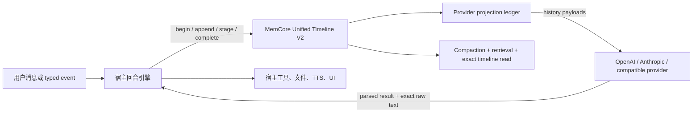

# MemCore Unified Timeline V2：亮点与接入指南

> 适用版本：MemCore `0.1.0`、AkaneCompanionLab 2026-07-21 本地主线。
>
> 当前状态：Akane 本地运行时已经完成 Unified Timeline V2 写链、读链、provider projection、
> 同步/流式真实 provider raw-result 和旧 prompt 权威清理。本文只描述已经接通并有自动化验证的能力；
> 尚未执行云端部署。

## 一句话定位

MemCore 是一个嵌入宿主进程的 Python 记忆内核，不是聊天模型，也不是独立 HTTP 服务。
宿主继续负责模型调用、工具执行、文件、UI、TTS 和业务规则；MemCore 负责把用户消息、环境事件、
模型中间话术、工具调用/结果和最终回复组织成一条可压缩、可投影、可检索、可审计的统一时间线。

## 核心亮点

### 1. 一轮模型调用只有一个真实生命周期

每次会触发模型回复的输入都遵循同一条生命周期：

```text
begin_turn
  -> append_entry(intermediate / action / observation)
  -> stage_turn_metadata
  -> complete_turn

失败路径：begin_turn -> ... -> abort_turn
```

- 普通私聊、群聊和 `event.finance` 等结构化事件使用同一套机制。
- 同一轮共享一个 `turn_id`；每个工具调用使用独立 `correlation_id`。
- 并行工具按“全部 action，再全部 observation”写入，结果不会靠物理相邻关系猜配对。
- 不触发模型回复的被动消息、材料 reference/cleanup 使用 standalone entry，不制造永久 open turn。

### 2. 同步和流式都保留真实 provider 原文

Akane 的同步调用返回内部 `ChatJSONResult(parsed, raw_text)`，流式调用返回
`ChatJSONStreamResult(parsed, raw_text, ...)`。写入 MemCore 的 `provider_output_raw` 是 provider
实际返回的消息正文：

- 不用 `json.dumps(parsed)` 反向伪造原文；
- JSON 空格、字段顺序和 provider 原始格式可以原样保留；
- parse fallback 或最终失败不会把损坏 raw 当作用户可见回复；
- raw 只在内部完成轮次时传递，不进入普通 API 响应、日志或 prompt audit 正文。

这使下一轮能够恢复 provider-native 历史，也让缓存前缀与审计结果建立在真实请求之上。

### 3. Provider-native Projection Ledger

MemCore 支持三种标准投影：

| profile | 用途 |
| --- | --- |
| `openai_chat` | OpenAI Chat/Responses 兼容消息结构 |
| `anthropic_messages` | Anthropic Messages 消息与 tool-use/result 结构 |
| `canonical_user_assistant` | 不依赖特定 provider 的安全回退 |

投影不是每轮临时重拼的字符串。它带有稳定 hash、source coverage、projection version、压缩代次，
并能审计实际请求是否仍保持严格前缀。system/developer 前缀、人格和工具 schema 仍由宿主管理；
MemCore 只提供跨轮历史消息。

### 4. 标注与最终回复原子提交

模型产生的 `memory_metadata` 先 stage 在本轮 stimulus 上，完成前不会提前获得普通检索准入。
`complete_turn()` 原子提交：

- 最终 assistant entry；
- stimulus 的终态 metadata；
- retrieval visibility；
- provider projection；
- turn close。

因此不会出现“metadata 已可检索，但最终回复尚未落库”的半完成状态。

Chat Output Adapter 同时返回 `metadata_status` 与 `metadata_present`，把记忆标注真值和回复交付解耦：

- `accepted` / `accepted_model`：provider 明确给出合法 metadata object；合法空 object 仍保持现有记忆体验；
- `accepted_host`：宿主从 legacy tags 等安全输入中确实补出了有效记忆信号；
- `missing` / `invalid`：不提升普通检索准入，但 speech、流式气泡、TTS 和对话保存照常进行；
- fallback 模板中的空 metadata 不冒充模型标注。

### 5. 关系感知检索与压缩

- 普通检索默认看 message/event 和记忆摘要，默认排除 `tool.*`、`material.*` trace。
- 宿主显式请求相应 kind/category 时，工具与材料轨迹仍可读取。
- 检索扩展和 token budget 以完整关系组为单位，不拆散 stimulus/final 或 action/observation。
- 压缩只处理 closed turn，并保留 summary/semantic lineage。
- `read_timeline()` 按日期和时间段精确读取原始时间线；`retrieve_*()` 负责语义检索，二者职责分开。

### 6. 隔离、安全与可诊断降级

- `tenant_id / user_id / domain_id` 是硬隔离键。
- `conversation_id` 控制当前会话窗口；`Actor` 只表达群聊发言人，不替代用户硬隔离。
- 持久 projection 拒绝 system/developer 消息，并清洗密钥、base64、绝对路径等不安全内容。
- 宿主门面统一返回 `ok / status / reason`；禁用、不可用、参数错误和执行失败不会伪装成功。
- 缺失 raw 时保存空字符串并保留可诊断状态，不伪造 provider 结果。

## 架构与责任边界



| MemCore 负责 | 宿主负责 |
| --- | --- |
| timeline、turn/relation、projection ledger | 调用具体聊天模型并取得真实 raw |
| staged annotation、原子完成/中止 | 解析最终业务 JSON、决定 UI/TTS/动作 |
| compaction、retrieval、timeline read | 执行工具、审批高风险动作 |
| Namespace/Actor 契约与安全清洗 | 文件本体、OCR/视觉结果、密钥和路径 |
| 结构化状态和审计 hash | 产品 fallback、重试和用户可见错误 |

## 安装与初始化

MemCore `0.1.0` 要求 Python 3.10+，当前按授权 wheel 或授权源码副本交付，不应假设可从公开
PyPI 获取。

从 wheel 安装：

```bash
python -m pip install ./memcore-0.1.0-py3-none-any.whl
```

从授权源码开发安装：

```bash
python -m pip install -e /path/to/memcore
```

初始化时必须提供：

- `LLMClient`：供摘要、语义沉淀和 verifier 使用的结构化模型适配器；
- `Namespace`：至少有稳定 `user_id`；
- IANA 时区，例如 `Asia/Shanghai`；
- 生产 embedding provider 或模型名。`HashedEmbeddingProvider` 只适合测试，不能静默当生产语义模型。

```python
from memcore import MemorySystem, Namespace

mem = MemorySystem(
    llm=my_memcore_llm_client,
    namespace=Namespace(
        tenant_id="tenant-a",
        user_id="user-42",
        domain_id="companion",
        conversation_id="conversation-7",
    ),
    timezone="Asia/Shanghai",
    storage_dir="./data/memcore.sqlite3",
    embedding=my_embedding_provider,
)
```

`LLMClient.call(request)` 的失败必须返回 `LLMResult(ok=False, error=..., data=fallback)`，不要把裸异常
穿透在线聊天主链。

## 最小 V2 回合接入

下面示例展示 package 级公共 API。`raw_text` 必须来自 provider 真实响应正文，`parsed` 是宿主从该
原文解析出的业务对象。

```python
import time

from memcore import (
    AnnotationStatus,
    EntryOrigin,
    OPENAI_PROFILE,
    RetrievalVisibility,
    TimelineEntryInput,
    TurnRole,
)

now = int(time.time())
user_source_id = "msg:user:0001"

stimulus = TimelineEntryInput(
    source_id=user_source_id,
    kind="message.user",
    origin=EntryOrigin.USER,
    turn_role=TurnRole.STIMULUS,
    semantic_text="帮我回忆我们上次定下的计划。",
    timestamp=now,
    payload={"text": "帮我回忆我们上次定下的计划。"},
    compatibility_role="user",
    retrieval_visibility=RetrievalVisibility.EXPLICIT,
)

turn = mem.begin_turn(
    stimuli=[stimulus],
    annotation_target_ids=[user_source_id],
)

try:
    # projection.payloads 可直接作为 provider 的跨轮 history；
    # system/developer prompt 和当前产品级工具 schema 由宿主另行拼接。
    projection = mem.build_context_projection(provider_profile=OPENAI_PROFILE)
    actual_history = list(projection.payloads)

    provider_result = call_your_provider(history=actual_history)
    raw_text = provider_result.raw_text          # 真实 provider 消息正文
    parsed = parse_your_final_json(raw_text)     # 宿主业务解析

    metadata = parsed.get("memory_metadata") or {}
    mem.stage_turn_metadata(user_source_id, metadata)

    completed = mem.complete_turn(
        turn_id=turn.turn_id,
        semantic_text=str(parsed.get("speech") or ""),
        provider_output_raw=raw_text,
        memory_annotation=metadata,
        annotation_status=AnnotationStatus.ACCEPTED_MODEL,
        source_id="msg:assistant:0001",
        timestamp=int(time.time()),
        provider_profile=OPENAI_PROFILE,
        provider_projection={"role": "assistant", "content": raw_text},
    )
    if not completed.completed:
        raise RuntimeError(f"memcore completion failed: {completed.status} {completed.reason}")
except Exception:
    mem.abort_turn(turn.turn_id, reason="host_turn_failed")
    raise
```

注意：

- 当前 stimulus 在 provider 请求中只能出现一次。
- `semantic_text` 是产品实际使用的最终语义文本；`provider_output_raw` 是真实原文，二者不要混为一谈。
- `provider_projection` 应是该 provider 下一轮需要恢复的 assistant 消息对象。
- 已完成的 `turn_id` 重试会返回幂等终态；宿主应检查 `status/reason`，不要重复构造另一条 final。
- 如果模型调用最终失败，调用 `abort_turn()`；不要写一条假的成功回复来闭合轮次。

## 工具调用与并行批次

每个工具分支必须有稳定 `correlation_id`。对并行工具，先追加全部 action，再追加全部 observation：

```python
from memcore import EntryOrigin, RetrievalPolicy, TimelineEntryInput, TurnRole

actions = [
    ("call_weather", "weather", {"city": "北京"}),
    ("call_calendar", "calendar", {"date": "2026-07-22"}),
]

for call_id, name, arguments in actions:
    mem.append_entry(
        TimelineEntryInput(
            kind=f"tool.{name}.call",
            origin=EntryOrigin.ASSISTANT,
            turn_role=TurnRole.ACTION,
            semantic_text=str(arguments),
            correlation_id=call_id,
            payload={"input": arguments},
            trace_metadata={"tool_name": name, "status": "running"},
            retrieval_policy=RetrievalPolicy.EXPLICIT,
        ),
        turn_id=turn.turn_id,
    )

results = execute_tools(actions)  # 宿主执行；成功、失败、取消都必须返回终态

for call_id, name, output, status in results:
    mem.append_entry(
        TimelineEntryInput(
            kind=f"tool.{name}.result",
            origin=EntryOrigin.ENVIRONMENT,
            turn_role=TurnRole.OBSERVATION,
            semantic_text=str(output),
            correlation_id=call_id,
            payload={"output": output},
            trace_metadata={"tool_name": name, "status": status},
            retrieval_policy=RetrievalPolicy.EXPLICIT,
        ),
        turn_id=turn.turn_id,
    )
```

`complete_turn()` 会拒绝仍有未闭合 correlation branch 的轮次。不要把“并行工具”实现为多个彼此无关的
turn，也不要用 `seq_no ± 1` 推断 call/result 关系。

## Projection 与请求审计

读取历史：

```python
projection = mem.build_context_projection(provider_profile="openai_chat")
history_messages = list(projection.payloads)

print(projection.stable_prefix_hash)
print(projection.compaction_generation, projection.projection_generation)
```

当宿主组装好一次真实 provider 请求后，可用 `record_request_projection()` 固化当前轮 suffix 并记录安全
hash。传入的 `history_messages` 必须是实际发送的历史消息，尾部必须与 `turn_messages` 完全匹配：

```python
from memcore import ProjectionMessageInput

audit = mem.record_request_projection(
    turn_id=turn.turn_id,
    provider_profile="openai_chat",
    turn_messages=[
        ProjectionMessageInput(
            provider_profile="openai_chat",
            payload={"role": "user", "content": "当前消息"},
            source_ids=(user_source_id,),
        )
    ],
    history_messages=actual_history_messages,
    attempt=1,
    model_route="chat-primary",       # 只传安全路由标识，不传 URL/key
    system_prefix=system_prompt,
    tool_schema=tool_schema,
)
```

持久审计保存 hash、source IDs、代次和结构化状态，不保存 API key、本地绝对路径或完整敏感 audit 正文。

## 读取接口

语义检索：

```python
result = mem.retrieve_for_turn_structured(
    current={"source_id": user_source_id, "timestamp": int(time.time())},
    query="上次约好的计划",
    limit=8,
)

if result.status == "ok":
    snippets = list(result.rendered_texts)
```

按日期精确读原始时间线：

```python
timeline = mem.read_timeline(
    date_from="2026-07-20",
    date_to="2026-07-21",
    time_periods=["上午", "晚上"],
    cross_conversation=True,
)

if timeline["status"] == "invalid_filter":
    handle_filter_error(timeline["reason"])
```

不要把 `read_timeline()` 的非法日期静默放宽成整库查询；不要把 prompt 已可见 source 再作为普通检索结果
重复注入。

## 在 Akane 中启用

Akane 通过 `companion_v01.memcore_integration.MemcoreManager` 使用 MemCore。该类是宿主内部薄门面，
不是另一个记忆实现。默认配置：

```dotenv
MEMORY_BACKEND=memcore
MEMCORE_STORAGE_PATH=
MEMCORE_VISIBLE_SCOPE=user
MEMCORE_ENABLE_FLAVOR=true
MEMCORE_SHADOW_COMPARE=false
MEMCORE_TOOL_TRACE_MAX_CHARS=12000
```

- `MEMCORE_STORAGE_PATH` 留空时使用当前 Akane 实例数据目录中的 `memcore_v01.db`。
- `MEMCORE_VISIBLE_SCOPE=user` 允许同一用户跨会话连续；`conversation` 只显示当前会话窗口。
- `MEMCORE_SHADOW_COMPARE` 是迁移诊断开关，不会双发模型请求或双执行工具。
- 新接入应使用 `memcore`。`legacy/dual` 只用于明确的迁移窗口，不应继续扩展旧权威。

Akane 内部推荐接口：

| 场景 | `MemcoreManager` 接口 |
| --- | --- |
| 开启模型轮次 | `begin_input_turn(...)` |
| 中间 assistant 话术 | `append_turn_intermediate(...)` |
| 同一批工具 action/result | `record_tool_batch(...)` |
| 暂存 stimulus metadata | `stage_turn_metadata(...)` |
| 原子提交 final + 真实 raw | `complete_input_turn(...)` |
| 失败闭合 | `abort_input_turn(...)` |
| 不触发回复的消息 | `append_standalone_message(...)` |
| 一次性旧数据迁移 | `import_legacy_message(...)` |
| provider 历史 | `build_context_projection(...)` |
| 请求 ledger/audit | `record_request_projection(...)` |
| 精确时间线读取 | `read_memory_timeline(...)` |
| 语义检索 | `retrieve_memory(...)` |

所有门面结果至少包含：

```json
{
  "operation": "complete_input_turn",
  "ok": true,
  "status": "completed",
  "source_id": "msg:assistant:0001",
  "index_status": "indexed",
  "reason": ""
}
```

调用方必须按 `ok/status/reason` 分支处理。`unavailable`、`invalid_record`、`forbidden`、`failed` 不是成功，
也不应被 UI 或监控显示成已保存。

## 从 V1 迁移

实时回合不要再使用 V1 的：

```text
record_user_turn -> update_turn_metadata -> record_assistant_turn
```

迁移到：

```text
begin_turn -> stage_turn_metadata -> complete_turn
```

工具迁移到带 `turn_id` 和 `correlation_id` 的 action/observation；结构化事件作为 stimulus 进入同一 turn；
一次性历史回填使用 Akane 的 `import_legacy_message()` 或批量 legacy import API，不能把迁移接口放回在线主链。

旧 prompt envelope、宿主自拼跨轮 tool history 和宿主自拼 raw/summary/history 都不应再成为第二权威。

## 实现索引

接入或审查时优先看这些文件：

| 关注点 | 文件 |
| --- | --- |
| Akane 回合生命周期与 raw 内部传递 | [`companion_v01/engine.py`](../companion_v01/engine.py) |
| 同步/流式 `ChatJSONResult` | [`companion_v01/llm_runtime.py`](../companion_v01/llm_runtime.py) |
| Akane → MemCore 薄门面 | [`companion_v01/memcore_integration/manager.py`](../companion_v01/memcore_integration/manager.py) |
| provider projection 读链 | [`companion_v01/engine_services/response_builder.py`](../companion_v01/engine_services/response_builder.py) |
| 真实 raw 回归 | [`tests/test_provider_raw_result.py`](../tests/test_provider_raw_result.py) |
| timeline/projection/tool/事件回归 | [`tests/test_memcore_integration.py`](../tests/test_memcore_integration.py) |

MemCore package 的权威接口在 `memcore.MemorySystem`、`memcore.timeline`、`memcore.projection`；宿主不应
复制其中的 renderer、ledger、relation expansion 或 compaction 算法。

## 接入验收清单

在宣布接入完成前，至少验证：

- 同步 raw 与 fake/real provider 原文逐字相同；
- 流式 raw 与 provider stream 拼接正文逐字相同；
- parsed 字段顺序变化不改变保存的 raw；
- 当前 stimulus 在实际 provider 请求中只出现一次；
- 普通、群聊、typed event 使用同一 turn lifecycle；
- 两个以上并行工具 correlation 不串，error/cancelled branch 也闭合；
- OpenAI、Anthropic、canonical projection round-trip；
- 下一轮历史保持严格前缀，或给出可解释的压缩/provider/media 断点；
- complete 前 staged metadata 不进入普通检索；
- tool/material trace 默认不进入普通检索，显式查询可读；
- 跨 Namespace 数据不可见，群聊 Actor 归因不丢；
- raw、日志、audit、projection 中无 key、base64、本地绝对路径；
- 不可用与失败返回结构化状态，不出现 fake success；
- 旧 prompt/history 写入器与 reader 已删除或只剩明确迁移入口。

## 当前限制

- MemCore 不提供独立 HTTP API；跨语言宿主需要自行封装服务边界并保持相同生命周期语义。
- MemCore 不保存文件本体，不执行工具，不管理桌宠 UI/TTS/音乐。
- `provider_output_raw` 是内部持久化数据，应按对话数据的隐私等级保护。
- 当前版本为 `0.1.0`，授权边界以 MemCore 仓库的 `LICENSE` 为准。
- 本文对应本地已验收代码；云端部署、真实云配置和线上回滚窗口需要单独批准与执行。

## 2026-07-21 本地验收记录

```powershell
# Akane：MemCore 生命周期、历史导入、provider 与 route 聚焦回归
python -m unittest `
  tests.test_memcore_integration `
  tests.test_finance_analysis_history_migration `
  tests.test_plugin_reasoning `
  tests.test_backend_route_modules

# MemCore package：Unified Timeline V2 核心组
python -m unittest `
  tests.test_timeline_v2_migration `
  tests.test_timeline_v2_standalone `
  tests.test_timeline_v2_turns `
  tests.test_projection_cache `
  tests.test_compaction_v2 `
  tests.test_relation_expansion `
  tests.test_retrieval_visibility `
  tests.test_slice_akane_alignment
```

结果：Akane 聚焦组 164 项通过；MemCore V2 核心组 93 项通过。Akane 全量运行 1648 项，仍有 3 个
与本切换无关的既有失败（capability offer 冻结预期、desktop satellite 的 `open_browser` 预期、settings
catalog 漂移），MemCore 主线没有新增失败。`py_compile`、Ruff 和 `git diff --check` 通过。
