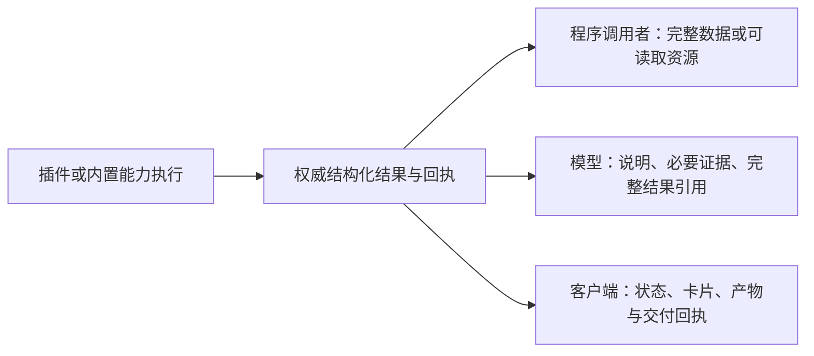

# 插件系统优化方案 V2

状态：目标模式分片实施中；P0a/P0b、P1 独立 SDK/工具组合、P2 公开事件、P3 观察/请求回合与旧渠道适配，以及 P4a 结果级 followup、P4b 停用后的迟到调用撤销、P4c 升级期间的调用版本与文件保留已落地，范围见[实施记录](plugin_system_v2_progress.md)。完成批次的撤权竞态已由 P4d1–P4d5 分片修复；P5a 接通版本化服务与跨 worker 调用，P5b 接通激活前依赖图、待依赖生命周期及部署 provider 选择，P5c 接通公开服务发现并收敛调用目录，P5d 迁移现有图像 provider 并接通完整结果转交，P5e0 修复语音 provider 选择与展示不一致；模型/TTS/ASR 等其余 provider 的公共服务迁移仍待后续切片。旧公开协议仍在迁移窗口，策略和后续接口按依赖继续推进，真实客户端体验仍待后续验收；P9a–P9f 已接通连接、调用回执、依赖等待、产物展示、聊天任务控制以及执行策略/资源限额详情，P10a-1 已接通进程内任务控制与公开 job 控制入口；F1 已补齐公开 Task 生命周期、回合制游戏状态闭环、代次撤权和真实安装回归，P10b 的最小游戏验收已完成。

P6a 已接通 SDK 0.8.3 的插件连接声明、现有配置保存、受保护的管理 API 与真实 HTTP worker 调用；P9a 已把通用连接配置表单接入控制中心 V2，策略/限额/服务专门面板和真实窗口体验仍待后续切片，范围见[实施记录](plugin_system_v2_progress.md)。

P7a 已接通 SDK 0.8.4 的部署资源配置、公开预算查询和跨 worker 共享调用计数；删除程序调用专有 16 KiB 参数墙与固定 4 层/32 次限制。P7a 本身不包含策略回调注册。

P7b 已接通 SDK 0.8.5 的部署选定策略服务、执行前决定与完成后只读观察，P7c 已接通 SDK 0.8.6 的权威值变换，P7d 已接通 SDK 0.8.7 的独立模型展示变换，P7e 已接通 SDK 0.8.8 的声明式执行生命周期包装；这些切片复用原服务安装、依赖图及 generation 生命周期，并提供可运行的个人/共享部署配置样例。超时专用策略和通用策略管理 UI 仍未交付，范围见实施记录。

P8a 已为受管插件接通显式依赖供应：离线 wheelhouse 或允许的包索引二选一；staging 预检 `Requires-Dist`，第三方依赖安装到插件自己的隔离 site，并向管理结果透传受控诊断。受控 wheelhouse 与本机 PEP 503 包索引均有真实安装验收；超时专用策略和 P9 其余控制中心体验仍未交付。

P8b 修复了 P8a 遗留的验收缺口：插件测试夹具现在向 `ManagedPluginArtifactStore` 提供真实依赖供应源，第一方图像/文档/翻唱安装与 SDK 组合验收恢复通过；无供应源时仍然明确失败，产品语义未放宽。范围见[实施记录](plugin_system_v2_progress.md)。

P11a 把公开文档收敛为单一权威：SDK README 补齐 `execution_class` 与调用/结果配对语义，`plugin-development` 技能改写为 SDK-first，新增 `scripts/verify_plugin_sdk_docs.py` 校验版本与文档 API 真实性；归属判据见[归属与边界](plugin_system_ownership_v1.md)。

P12a-1 已把 QQ 戳一戳通知变成公开的有类型事件 `POKE_CONVERSATION_EVENT`（SDK 0.8.9），宿主业务策略、插件反戳动作入口与第一方插件替换仍待 P12b/P12c。

日期：2026-09-09。依据：当前仓库调用链、[多视角审查](plugin_system_multiview_audit_20260908.md)和 DeepSeek Harness 本地源码快照。实施次序以本文为准，审查报告保留问题证据。

## 0. 外部设计依据与不可偏离原则

事件、上下文、长任务与组合机制的目标形态参考了以下项目的公开设计；只吸收共同的架构原则，不复制任何项目的具体 API：

- **DeepSeek Harness**：把模型、工具、Skill、Session、Storage、调度与 UI 放进同一可组合体系，用服务与事件连接，核心价值是"可替换、可组合、不改宿主源码"。
- **OpenAI Agents SDK**：工具、Agent 与生命周期回调共享同一本地运行上下文，但明确区分"代码可见上下文"与"模型可见上下文"；本地上下文不会自动发送给模型。
- **LangGraph**：把状态、checkpoint、interrupt 与 resume 作为长任务的一等能力，中断后保存状态并等待恢复。
- **Koishi**：把 Context、事件与服务作为插件系统的核心连接面，插件不直接依赖宿主内部对象。

由此固定本轮及后续的不可偏离原则：

```text
插件可以表达业务数据；
宿主签发身份、作用域和版本；
Context 不等于 MemCore 内部结构；
事件、观察、时间线与 Agent 回合分别表达；
工具结果可以被程序和模型共同消费；
长任务必须有真实状态和恢复边界；
插件通过公开 SDK 组合能力，不修改宿主业务代码。
```

目标公开 API 只暴露这些入口：

```text
plugin.tool(...)  plugin.on(...)  plugin.service(...)  plugin.background(...)
ctx.tools  ctx.services  ctx.events  ctx.context  ctx.timeline  ctx.agent  ctx.task
```

`ctx.task` 现在提供最小真实生命周期：创建、状态查询、更新为运行/终态、暂停、恢复和取消。它只投影既有 Host Job 权威，不创建第二套任务数据库、调度器或权限体系。

"一切皆插件"是最终方向，但前提是这些连接面先稳定；本轮与后续切片都不把调度、UI、存储和长任务同时开放为可替换组件。

## 1. 要交付的结果

**让模型和第三方开发者只靠公开 SDK，就能开发、安装、组合插件并完成真实任务；部署者能通过配置或策略扩展改变行为，无需修改宿主。**

同时降低两种成本：日常插件需要理解的概念数量，以及完成一种新功能时必须修改的宿主文件数量。增加入口、类型和权限名称，本身不算提高可扩展性。

交付后应能直接做成这些事：

1. 一个查询插件返回完整的列表、数值和长文本，模型或另一个插件都能消费。
2. 一个插件发布事件，另一个插件执行确定动作，不调用模型，也不需要理解 MemCore。
3. 游戏插件更新局面，需要决策时再请求模型；能够等待对手、暂停、恢复和停止。
4. 一次工具执行完成后，可以明确不再请求模型；结果、错误、任务状态和交付回执仍可查看。
5. 第三方注册自己的服务、连接配置和展示，使用者在扩展中心完成配置，无需改宿主分支。
6. 模型通过公开文档完成从源码到真实调用的安装闭环；出错后能够定位并自行修复。

本方案会改变公开接口和部分默认行为。采用分片迁移，复用既有运行时；每个替换切片同时处理旧实现，避免新旧两套权威并行。

“无需修改宿主”指框架切片交付后，在已支持契约内新增业务插件或替换实现。框架建设本身需要修改宿主；尚未开放的硬件或客户端能力仍需新增接入切片，不能靠插件声明就假定已经可用。

## 2. 对照参考项目：比较实际接入能力

参考为官方 [DeepSeek Harness](https://github.com/deepseek-ai/DeepSeek-Harness) 本地快照 `f116b7c20faa2c99a9fc324dfd0527ad9d0ca2e3`。只比较已阅读的代码和接口，不据此评价当前社区规模、用户满意度或模型效果，也不宣称这是最新版本。

| 能力 | Akane 当前实际情况 | DeepSeek Harness 参考机制 | Akane 的验收目标 |
| --- | --- | --- | --- |
| 定义工具 | Adapter、Descriptor、slot、权限等多处表达 | `ctx.tools.register()`；typed helper 或原始 JSON Schema | 简单工具是一个函数；一份输入/输出契约进入所有调用入口 |
| 程序组合 | 插件间调用限定文件产物；非工具回调缺少作用域 | 可见工具在 Code Mode 中复用正常执行链，取得 canonical value | 查询、计算、文件能力可组合；事件和任务也可在其授权作用域调用 |
| 结果 | 小容器限制、文本/字段启发式拒绝、展示与数据混杂 | 规范结构化值与模型/UI 投影分离 | 合法业务数据无损；模型展示过长时可读取完整结果 |
| 事件 | 可订阅；缺通用发布端口；投递选项与记忆/唤醒耦合 | 事件扩展点与服务配合，模型输入由明确操作触发 | 发布/订阅、观察更新、请求模型分别可用 |
| 服务和提供者 | 对外缺通用注册/依赖契约，连接有固定名称 | 服务注册、依赖注入、配置选择 provider | 第三方可提供并替换服务；依赖可发现、可诊断 |
| 执行策略 | Hook 主要观察，规则大量写在宿主 | 执行前决策、执行包裹、结果变换与最终观察 | 部署者可选择/替换策略，不 fork 宿主 |
| 用户展示 | 产物/通知能进入宿主路径，独立展示扩展不足 | 结果渲染与声明式 UI card 分开 | 插件声明配置、状态、调用和结果展示，由现有客户端呈现 |
| 开发反馈 | 有源码测试/暂存/安装；依赖供应和失败定位不足 | 本地模块/包组合、服务依赖、生命周期卸载 | SDK 独立可装，依赖明确，开发重载短，安装失败可修复 |

参考源码入口：`docs/cookbook/adding-a-tool.md`、`docs/cordis-tutorial/03-services.md`、`docs/cookbook/extension-cookbook.md`、`packages/core/tools/src/index.ts`、`packages/bundle/base/cordis.patch.yml`。路径相对参考仓库 `deepseek-harness`。

这里借鉴的是公开组合能力、数据与展示分离、部署策略可替换。实现继续使用 Akane 当前语言和运行时，不以改用另一套框架为前提。

## 3. 设计决策

### 3.1 常见插件只面对三个概念

- **工具**：一个有输入/输出契约的可调用函数。
- **事件**：一个带类型名和结构化数据的事实，可以发布和订阅。
- **上下文**：宿主已绑定当前任务或会话，插件据此调用能力、更新观察、请求模型处理。

只有需要时再使用配置、插件状态、资源、任务、服务或策略。普通插件不填写 profile/session/character/MemCore 字段，不构造 generation、broker、artifact sink，不理解宿主内部存储位置。

SDK 采用单一公开导入入口 `akane_plugin`，P1 实现见 [SDK 0.2.0](../akane_plugin/README.md)，提供简单函数注册与高级完整 schema 注册。编译到同一个 CapCore ToolSpec；不另造一套参数 DSL、验证器和工具注册表。Python 类型提示可以生成简单 schema，复杂输入可直接声明公开的 JSON Schema。

### 3.2 扩展能力分层交付

| 层级 | 接入内容 | 何时算完成 |
| --- | --- | --- |
| A：通用业务插件 | 工具、数据结果、事件发布/订阅、上下文、结果后续策略、资源与普通后台作业 | 事件到动作和查询到文件可以通过公开接口跑通 |
| B：生态扩展 | 服务/连接/provider 注册、依赖、策略扩展、配置和声明式展示 | 第三方新增服务及替换一个真实 provider，无需修改宿主业务代码 |
| C：持续任务 | 等待事件、模型决策、暂停/恢复、真实游戏状态 | 模型通过插件完成一局真实游戏并可中断、恢复 |

A 完成只能宣布“通用业务插件可用”。B 未完成时不能宣布“宿主能力都已可替换”；没有进入真实运行链的扩展类型也不能先放到 prompt 或 UI 中。

### 3.3 第一方使用同一条公开路径

优先把一个现有查询/文档能力、一个真实服务提供者迁到目标契约上。第三方和第一方使用同一注册、调用、配置、结果与展示路径。纯服务插件不需要伪造模型工具或申请 `capability.prompt.invoke` 才能加载。

发现第一方必须走私有捷径时，应补全公共契约，并删除被替换的旧分支。无需把所有模块同时抽包；每次抽包遵循 [M63 收敛政策](package_reintegration_policy_m63.md)。

### 3.4 实现必须同时满足的约束

以下是宿主实现约束，不要求普通插件作者额外填写字段：

| 问题 | 唯一判定依据 |
| --- | --- |
| 谁能执行动作 | 宿主签发的调用/自动化作用域与当前授权；收到事件本身不授予权限 |
| 程序得到什么 | 输出 schema 对应的权威值；模型预览不改变程序返回类型 |
| 谁继续处理结果 | 调用时已绑定的消费者；程序回调不会因工具默认值自动变成模型任务 |
| 是否请求模型 | 已绑定模型任务的后续决策，或显式 request_turn；事件传输和状态更新不隐式触发 |
| 何时算完成 | 分发、执行、交付各自的真实回执；受理和文件生成都不等于交付成功 |
| 谁维护状态 | 目录、工具契约、执行、任务状态分别复用既有权威；适配器只翻译旧输入输出 |
| 停止后还能做什么 | 保留结果和回执，拒绝后续调度；不能借热更新、事件重投或子调用复活任务 |

后续切片若不能同时满足这些约束，先修订契约或缩小交付范围，不用新增宿主业务特例来掩盖矛盾。

## 4. 数据与工具：先解除实际阻断

### 4.1 删除、迁出与保留的规则

| 当前规则/行为 | 决定 | 目标行为 |
| --- | --- | --- |
| 字段包含 `token/secret` 就拒绝，文本以 `/` 开头就拒绝 | 删除业务内容启发式规则 | `token_count`、`/help`、任务所需操作路径等按真实业务数据传递 |
| 所有结果字符串最多 4096 字符、容器最多 64 项 | 删除通用业务上限 | 业务大小由工具 schema/生产方规定；系统资源预算单独管理 |
| 把参数说明截成不完整片段 | 删除静默截断 | 必需契约完整投影；长尾工具按需加载完整 schema |
| 同能力因入口不同额外撞到 16 KiB 参数墙 | 统一有效预算和传输方式 | 不让成功与否取决于从模型还是插件调用；大数据可走资源引用 |
| 互调必须是文件产物且带 `send_to_user` | 删除 | 支持查询、计算、普通 JSON 和产物；交付单独表达 |
| 当前回合观察自动请求模型 | 拆开 | 更新观察不会自动唤醒，显式请求模型才调度 |
| 生成文件/图片一律阻止结束模型回合 | 删除类型决定论 | 根据是否还有未消费结果和待完成交付决定，不因有文件就多请求一次模型 |
| 调用并发、队列容量、RPC 最大帧、任务截止时间 | 移到部署资源配置 | 同一有效预算可查询；触及预算返回实际值、限制来源和可恢复方式 |
| 身份绑定、真实错误、执行回执、停止与清理 | 保留并统一 | 防止串会话、假完成、重复副作用；不对普通文本追加业务禁令 |

凭据和宿主内部路径通过专用连接/配置接口明确标记私密性，并在宿主投影日志、模型输入和 UI 时保护；普通业务字段不通过模糊匹配猜测是否私密。公开结果允许模型完成任务所需的路径，不能用 `[local_path]` 破坏其可执行语义。

合法 JSON 的类型/序列化校验继续存在。不承诺无限进程内存；生产方声明、部署预算和底层传输边界各自明确，不能层层添加未知的小上限。

### 4.2 一份权威结果，三种消费方式



- 普通函数可直接返回对象、列表、数字、布尔、字符串或 null；SDK 包装成功结果。
- 只有需要声明后续行为、产物或展示时才返回显式 Result 包装。
- 返回 schema 是程序组合契约。调用者无需解析“已完成，请查看……”等自然语言来提取 id。
- 模型展示不足以容纳完整结果时，存为可读取材料并返回 `complete=false`、完整引用与续读信息；默认展示不能冒充完整数据。
- 程序调用拿到输出 schema 声明的值，不接收模型用的截断预览。声明返回列表的函数，不能因结果变大就改成资源句柄；底层若分块传输，由 SDK 组装后返回列表，超出有效资源预算则明确失败。需要流式/资源输出的能力从一开始就在 schema 中声明该类型。
- 模型预览的 `complete=false` 属于展示元数据，不写进业务 value。完整结果引用读取同一次执行保存的结果，不为“续读”重新执行工具。资源有效期和不可读原因明确；任务引用期间需按配置保留，预算不足或到期不能伪造完整数据。
- 权威结果本身不必每次完整复制进会话历史、日志和 UI；这些消费者只取得各自需要的投影。
- 不再把容量、schema、连接失败全部转成 `plugin_result_not_safe`。错误至少包含 `code/message`；定位信息按需包含 `field/expected/actual/retryable/diagnostic_id`，调用者无需填写整套字段。

### 4.3 通用调用路径

模型调用、插件互调、事件回调、后台任务和会话 HTTP 调用，最终都进入现有 admission/ExecutorBroker 和同一 ToolSpec。可见性、可执行性分别表达：内部服务可以不暴露给模型，但仍能被合法调用方依赖。

事件/任务获得自己的已授权执行作用域，不再以“必须正在执行另一个模型工具”为前提。作用域由创建任务、绑定事件来源或用户启用自动化时取得，插件只拿不透明引用。后台工作能在普通模型回合结束后继续，但停用、取消或撤销授权会结束其作用域。

互调继承调用者的作用域，权限不会因被调用插件更强而扩大。事件订阅则使用启用该自动化时明确授予的范围，并验证事件来源和目标绑定；不继承发布者的权限，也不接受 payload 中自报的会话身份。未绑定会话的全局事件仍可做已授权的全局计算，但 observe/request_turn 返回 `context_unbound`，不得猜测“最近聊天”作为目标。

程序调用由程序接收结果：目标工具的 followup 默认值不创建模型消费者。SDK 的普通 call 在成功时解包 value，失败时抛出携带结构化错误和回执的公开异常；需要回执/产物的调用可取完整 Result。异常未被处理时，由调用所属任务记录失败，不静默丢失。

跨插件调用保留调用链与取消传播。递归/扇出预算由任务资源配置控制，默认值和实际剩余量可诊断；长循环应作为任务执行，不能把“最多 32 个依赖请求”当作所有自动化的功能上限。

## 5. 事件和模型工作：移除 MemCore 学习门槛

### 5.1 四种意图独立表达

| 作者意图 | 目标 SDK 能力（拟议名称） | 默认行为 |
| --- | --- | --- |
| 发生了一件事 | `events.emit()` / `on()` | 只通知订阅者，不写聊天、不唤醒模型 |
| 当前状态更新 | `ctx.observe(key, data)` | 按任务/会话和来源替换该键的最新观察，下一次决策可见，不自动运行模型 |
| 需要模型接手 | `ctx.request_turn(reason, data)` | 向当前正常 Agent 调度入口提交请求，返回真实排队/合并/拒绝回执 |
| 希望保留一次共同经历 | 可选的会话记录服务 | 由公开保留语义交给现有会话/记忆链，普通事件不必调用 |

事件 data 使用有类型的 JSON，数字和嵌套对象保持原类型。事件 id/source/scope 默认由运行时生成或继承；外部来源有自己的幂等 id 时可显式提供。

事件传输、业务状态保存、当前观察、会话记录分别负责自己的生命周期。替换 MemCore 实现不应要求普通插件改代码。

observe 在下一次决策组装输入时按来源/键读取最新版本，沿同一上下文投影和预算进入模型输入；超长内容有引用，不能仅保存在不可见字段里。已经开始的模型请求使用其输入快照，不在请求中途改写棋盘。request_turn 可显式携带所依赖的观察版本；排队期间状态再次变化时，调度入口按声明选择最新状态或拒绝过时请求，不以旧棋盘冒充当前状态。

### 5.2 分发行为

- 订阅不是“只观察宿主消息”：插件和宿主都能通过同一入口发布自定义事件。
- 事件回调可调用普通能力或服务；无需制造一个模型回合来取得调用权限。
- 发布立即返回分发 id 和受理状态：没有订阅者、已受理或拒绝；每个订阅者的执行结果随后可查询。多个订阅者可部分成功，不能用单个“已处理”掩盖失败。回调转交后台任务时记录关联任务，任务结束前不标业务完成；产物交付另有回执。
- 慢处理通过既有任务执行机制承接，发布方无需等待完整业务动作；删除所有回调固定两秒才能做完业务的假设。
- 为状态快照提供可选的 latest 合并，并将被替代的待处理项标为 superseded；为顺序动作按订阅及作用域串行处理。两者由事件/订阅声明，不把所有事件强制去重或合并；latest 不撤销已经执行的副作用。
- 第一轮只交付进程内瞬时事件，不自动重试有副作用的处理器。可靠队列/跨重启恢复另设切片，尚未实现时对持久订阅请求明确返回不支持。未来重投至少需要稳定事件 id、处理方幂等约定和 checkpoint，不承诺队列能保证外部动作恰好执行一次；MemCore 不充当消息队列。
- 模型忙时，新请求进入现有任务/会话调度链；不每个事件另起并发模型实例。停止后的旧事件不能重新激活已终止任务。

### 5.3 新手示例不出现记忆内部参数

P2 的 SDK 0.3 已实现下列事件 API。可运行的两个独立项目位于
`examples/plugins/akane_sdk_event_source` 和 `akane_sdk_event_calculator`；公开
权限、回执和作用域契约见 `akane_plugin/README.md`。P3a 的 SDK 0.4 已接通
`ctx.observe` 与下一次模型决策输入。P3b 的 SDK 0.5 提供 `request_turn`、版本依赖、
回执、取消及正常会话队列；独立棋盘项目位于 `examples/plugins/akane_sdk_board`。
旧渠道语义的剩余迁移见 `docs/plugin_turn_migration_v2.md`。SDK 0.6.0 已提供
Result.followup；同步与后台结果共用同一决策，见 `docs/plugin_followup_migration_v2.md`。

```python
from akane_plugin import Plugin

plugin = Plugin("example.math", permissions=("event.emit", "capability.invoke"))

@plugin.tool(description="计算两数之和")
async def add(a: int, b: int) -> int:
    return a + b

@plugin.on("example.numbers_ready")
async def calculate(event, ctx):
    value = await ctx.tools.call("example.math.add", event.data)
    await ctx.events.emit("example.sum_ready", {"sum": value})
```

此例中模型可直接调用 add，事件处理器也能调用它，再把有类型的结果发布给另一个插件；这条确定处理链不发起模型调用，无需给 add 特意设置 none。简单工具的 schema 由签名生成；复杂对象需要明确 schema，不能用 `dict` 注解假装复杂输出已完整描述。需要影响模型调用后的处理时，才按第 6 节返回 `Result(value=实际结果, followup="none")`。

另一个游戏订阅只需更新棋盘观察，并在轮到模型时请求决策；保存共同经历是可选步骤。示例应展示公共事件发布入口，而不依赖宿主测试代码手工调用私有 broker。

## 6. 工具结束后是否继续请求模型

### 6.1 统一选择

先确定结果消费者，再决定是否继续模型处理。普通程序、事件处理器和程序后台任务永远先把结果交回调用程序；工具的 followup 不会替它们创建模型任务。它们需要模型时，显式调用 request_turn。

对于**已绑定模型任务的结果**，目标契约提供 `followup = auto | required | none`，可在工具声明设置默认值，在本次 Result 覆盖；普通工具默认 required，保持现有依赖结果继续回答的体验。同步工具与后台完成使用同样的语义，后台任务创建时保存消费者和继续处理约定。

- `required`：该结果需要交给所属模型任务继续处理。
- `none`：该结果不额外发起模型调用；对程序调用者仍返回真实结果。
- `auto`：调用时有明确消费需求就继续；调用者已允许直接结束且交付已由确定流程接手时可结束。信息不足时按 required 处理，不靠宿主猜测自然语言判断“任务大概做完了”。

**它控制该结果的后续模型请求，不等于擅自终止整项用户任务。** 一个子调用的 none 不吞掉同批其他结果，不中止等待它的程序调用，也不清除任务未完成的步骤。

决策顺序如下；继续处理约定由模型调用适配层/任务调度层绑定，普通工具作者不填写宿主任务字段：

1. 用户停止或作用域撤销：禁止后续调度，保留已经发生的结果；取消不能承诺撤销已经发生的外部副作用。
2. 程序消费者：返回 value/错误，由程序继续；不进入模型 followup 判断。
3. 模型消费者明确要求使用结果继续计算、修复或回答：该要求优先于 none。只有普通默认值时，本次 Result 可以覆盖工具默认值。
4. 按 Result → 工具默认值解析 followup，再聚合同批待消费结果和已登记的后续步骤。只要还有需要模型消费的结果，就继续所属任务；不为每个结果各起一轮模型。
5. 无需模型的交付/状态收尾由确定流程完成；交付失败仍记录真实失败，并由已有处理者修复或向用户展示错误，不能以 none 标为任务成功。

none 只取消该结果带来的隐式续答，不是“禁止这项任务未来一切模型请求”。订阅者主动 request_turn、用户新输入或另一待处理结果仍可能请求模型；0 次新增模型调用的验收需要排除这些独立触发源。文件/图片类型本身不构成继续推理的理由。

### 6.2 结果、错误、交付独立保留

| 场景 | 目标行为 |
| --- | --- |
| 切换状态成功，无需再说一句话 | 返回/记录执行结果，结束该次后续处理，模型请求数增加 0 |
| 后台检查没有变化 | 更新任务状态，不额外请求模型，不生成空通知 |
| 程序组合中的一步成功 | 将数据交给程序调用者，由它继续，不单独唤醒角色 |
| 文件已生成且交付链可直接完成 | 显示真实交付回执，可不请求模型 |
| 工具失败，程序调用者已处理 | 返回真实错误给调用者；不强制转为一轮角色回复 |
| 模型任务依赖的结果失败且未处理 | 交给任务继续修复，或向用户展示明确失败；不能假成功或静默丢失 |
| 批次中只有部分结果选择 none | 其余结果正常继续，不能整体提前收工 |

是否记录会话、是否展示 UI、是否自动发送产物，各自独立。无后续推理不意味着结果不留痕。

模型发起的工具调用仍须保存对应的协议结果，即使此刻不再请求模型；下次正常对话继续时，历史中的调用与结果必须配对。是否保存为用户可见聊天或长期经历是另一项选择，不影响协议完整性。

迁移时，旧 `model_followup/finish_turn/completion_mode` 由边界适配到这个契约。`finish_turn` 不再作为插件业务参数到处注入；旧调用记录仍可解释，新默认教程只出现一种后续处理概念。

## 7. 服务、连接、策略与展示：扩大真正的接入点

### 7.1 服务和 provider

目标提供注册服务、声明依赖、查询可用实现和调用方法的公开契约。跨 worker 服务使用有版本的 JSON/RPC 方法 schema；不会把另一进程的 Python 对象或 Engine 对象直接塞给插件。

服务方法复用同一执行链的作用域、取消、预算和回执，但不必伪装成模型工具。向模型开放某个方法时，其工具适配委托服务方法，不再维护第二份业务实现；服务目录表达依赖，工具目录表达模型可调用项，二者不争夺同一种权威。

- 服务声明自身 id、版本、方法输入/输出和可用状态。
- 消费者依赖服务契约，不依赖固定插件包或宿主 import 路径。
- 激活前检查依赖图；缺依赖与循环依赖分别给出诊断，不能互相等待到超时才统一报错。
- 部署配置选择 provider；缺依赖时显示明确待依赖状态，避免泛化 activation_failed。
- provider 切换时，已经开始的一条调用链固定其依赖快照至完成/取消；新顶层调用选择新 provider。工具定义的回合冻结与服务依赖的调用快照分别生效，不在一条正在运行的调用链中途换实现。消费者的生命周期随依赖状态变化，显式停用/撤权仍优先。
- 纯服务、连接或策略贡献本身可以使插件成立，不要求同时注册模型工具。
- 第一批选择一个真实游戏/数据服务和一个现有可替换 provider 验证。模型/TTS/ASR 等分别迁移公开契约，不能只增加空的 `providers` 字段就宣称支持。

### 7.2 配置与连接

插件声明业务配置 schema（类型、默认值、说明、是否私密）和连接需求。现有设置服务负责存储与投影，扩展中心根据 schema 生成表单；连接提供者负责解析/测试该服务。

第三方应能新增一个真实 API 连接，而不用扩展 `CONNECTION_PERMISSIONS` 的固定业务名称。资源授权从“给每种服务新增常量”收敛成“哪项插件被允许使用哪个已配置服务”的可解析绑定。

现有生图、RVC 设置作为该统一连接契约的适配源迁移，避免新旧配置各存一份。配置版本在下次调用生效，进行中的调用使用其已取得的快照。

配置就绪、服务连通、最近业务调用成功分别展示；健康检查不自动发起收费业务。部署者可选择提供有明确行为的“测试连接”动作。

### 7.3 策略扩展

在既有执行链增加可替换的策略点：执行前决定、执行生命周期包裹、结果投影/变换和最终观察。范围覆盖插件与内置能力，执行顺序可检查，避免只约束第三方。

策略由部署者装配；普通业务插件只声明效果/服务需求，不重复实现审批。提供个人自托管和共享部署预设，具体授权仍以部署者选择为准，升级不自动扩大已有授权。

启动先加载宿主的既有授权配置和最小执行规则，再装载部署者选定的策略贡献，最后激活业务插件。策略装载不通过它自己尚未注册的业务工具审批；需要外部依赖的策略按依赖图检查，不能形成启动环。P7 之前使用既有授权链，前面切片不等待未来的策略插件。

结果变换若改变权威 value，必须在最终定稿前通过同一输出 schema 校验，失败保留执行回执并报告结果处理失败，不自动重跑副作用。只改变模型/UI 展示的策略不能改程序值。定稿后观察器只读，其失败进入诊断，不将已成功动作伪报为未执行。

默认可保留适合部署场景的资源预算，但不重新包装已决定删除的内容误伤规则。策略失败必须返回明确策略 id、阶段和原因；观察型插件失败与执行拦截型策略失败分开处理。

插件安装授权和每次业务调用授权分别表达。部署者已信任的源码目录/制品及批准能力范围，可按其配置自动更新；新增超出该范围的权限再形成具体差异。无需每次由模型重复抄写整份权限清单。

### 7.4 用户展示与渠道

开放声明式配置表单、状态、工具调用卡片、结果卡片和操作按钮。按钮回到同一公开命令/工具入口，沿现有 UI bridge 与交付链执行；UI 不直接调后端/Tauri。

初始通用卡片覆盖数据、文件、动作状态和错误，不要求每个业务插件修改控制中心。图片、声音和文件沿已有媒体/产物链展示，事件回复继续使用正常角色输出，避免气泡、表情、TTS、音乐状态冲突。

渠道能力也应通过可发现的 action/service 契约公开；QQ 反戳作为后续渠道验收，暂不混入通用事件第一片。桌面游戏操作由桌面执行提供者负责，后端负责调度，遵守现有架构边界。

## 8. 开发、安装与模型发现体验

### 8.1 一条开发闭环

目标流程：选样例/创建项目 → 本地测试 → 暂存检查 → 按现有授权安装/更新 → 真实调用验收。

- 公开 SDK 可在干净 Python 环境中安装和 import，发布明确兼容版本；第三方不依赖宿主目录布局。
- 源码项目、SDK 样例、测试工具和运行时契约同版本交付。`alias:akane-sdk` 保留为模型的便捷发现入口，不能代替对普通开发者的 SDK 分发。
- 简单开发工具整合现有 test_source/stage_source/install 服务，减少模型手工拼装动作；不创建第二个安装器。
- 开发重载沿现有候选代/last-good 机制运行。失败只替换失败候选，不破坏当前能用的版本。
- 依赖供应是部署选项：离线 wheelhouse 或允许的包源；使用锁定结果和插件自己的依赖环境。不能把 `--no-deps` 作为所有第三方永远无法改变的前提，也不能自动污染宿主 Python 环境。
- SDK、依赖、连接、事件来源和 provider 缺失在安装前尽量预检；真实业务仍以调用结果确认。
- 构建失败提供可操作的错误摘要、缺失包/版本、失败阶段和诊断编号；开发者可通过管理接口读取受控诊断，不能只看到统一失败码。
- 取消测试、暂存或安装必须排空其进程；不要遗留开发工具派生的后台任务。

### 8.2 模型发现

已安装可用能力使用一个目录权威，提供 id、用途、schema 版本、调用条件及运行状态。常用小工具可常驻；长尾工具通过现有发现体系按需取得完整 schema。发现结果必须可立即调用，不能要求模型在多个目录间猜路由。

需要调用历史已知工具时验证当前存在及版本，不因它未常驻 prompt 就报未知工具。发现返回的是当前作用域可调用的快照，不保证跨越之后的撤权或停用仍可执行。普通升级时，同一轮继续使用冻结代次，旧代排空后卸载；显式停用/撤权优先于冻结，新调用返回明确不可用，排队事件取消，进行中调用按取消契约收尾。

完整参数说明只保留一份，注册/SDK/provider 不能各自截断出不同语义。不把所有 SDK 教程放进普通对话；模型开发插件时再加载开发说明和最小样例。

### 8.3 对外 API

保留管理诊断接口的含义；增加或适配明确绑定当前任务/会话的真实执行入口，使用已有认证与作用域签发，不接受任意裸身份冒充上下文。

管理接口、模型管理工具和控制中心共用 lifecycle 服务。公开检查接口返回当前支持的扩展点、SDK 版本、有效资源预算、依赖和可读 schema；运行时未实现的能力不列入支持清单。

## 9. 旧接口收敛与兼容

按 [M63](package_reintegration_policy_m63.md) 执行。新 DTO/SDK 类型落到一个权威实现，旧 `companion_v01.plugin_api` 可以薄重导出/适配，不能复制一套实现长期维护。

| 旧入口/规则 | 目标归宿 | 同片应删除或收敛的内容 |
| --- | --- | --- |
| `CapabilityIOSlot` 到工具的投影 | 同一 CapCore ToolSpec；简单函数与完整 schema 共用 | 宿主重复参数规范化、说明截断、默认空 schema 假兼容 |
| `PluginResultPayload/Experience` | 权威 value + 可选模型展示 | 内容启发式拒绝和重复数据拼装 |
| 文件专属 `PluginCapabilityPort` | 通用 scope 内调用 | generated_file/send_to_user 前置要求及私有结果解析 |
| `PluginEventResult` 三种 delivery | 事件、观察、模型请求/记录的边界适配 | 新调用不再使用三种去向协调所有行为 |
| `PluginAgentEventRequest` | 正常 Agent 调度入口的 SDK 包装 | 普通作者手工构造 memory_idempotency_key、宿主身份和展示内部字段 |
| `finish_turn/model_followup/completion_mode` | 同一后续模型处理决策 | 不同入口独立决定“要不要再请求模型”的规则 |
| 固定连接映射 | 注册的连接/provider + 原配置适配 | 新服务逐项修改宿主的业务白名单 |
| 观察 Hook | 独立观察用途；策略迁到有明确语义的执行扩展点 | 同一规则既在 Hook 又在执行器判断 |
| 旧管理工具动作组合 | 现有 lifecycle 服务统一协调 | 新增管理 UI/CLI 各自维护安装或插件启停状态 |

兼容策略：旧 SDK 已发布版本通过薄适配保留已约定的输入输出形状和显式副作用；协商版本和不支持字段在装载前给出明确结果。第 4 节明确删除的内容误伤、静默截断和通用小上限属于有记录的行为修复，不以“兼容”为由在旧入口保留第二套过滤器。迁移说明区分协议变化与这些修复，不笼统承诺全部历史行为不变。

旧事件适配把 current_turn 明确翻译成新 observe 与 request_turn 的组合，以兼容已有插件；新 observe 不继承该副作用。迁移窗口开启的切片必须登记旧入口清单、起始提交、目标删除版本和禁止继续扩展旧路径的回归检查。第一方插件迁完、对外提供迁移说明后，在该明确标记的破坏性 SDK 发布中删除弃用入口；不能无限保留新旧行为或在普通聊天反复提示弃用。

存储、产物句柄、历史记录和现有插件版本升级另列迁移范围。一个公开 API 切片不得顺便修改数据库或角色记忆规则。

## 10. 实施切片与退出条件

每行是独立可验证切片，不代表一次同时修改全部文件。存在运行故障时先停在修复阶段。未完成前置切片不叠加后续功能。

| 切片 | 改动边界与主要入口 | 可见结果与验收 | 明确前置 |
| --- | --- | --- | --- |
| P0a 结果契约修复 | `plugin_result_projection.py`、结果 codec/bridge、既有资源读取链 | 正常字段、长列表/长中文通过真实 worker；同次结果可续读，程序值不变型，失败可诊断 | 无；首个实施切片 |
| P0b 完整 schema | CapCore/参数投影、发现结果 | 模型所见契约与执行一致，不静默截断；输入/输出校验只有一份权威 | P0a |
| P1 简单 SDK 与通用工具组合 | `plugin_api.py`、SDK 最小打包、`plugin_capability_calls.py`、既有 broker | SDK 可在干净环境安装；查询→文档使用公开互调；绑定程序消费者且不自动请求模型，无文件前置限制 | P0b |
| P2 事件发布与执行作用域 | `plugin_events.py`、generation 回调、公开上下文 | 两个独立插件完成事件→动作，模型调用数为 0；停用撤销订阅和后续行动 | P1 |
| P3 模型观察与唤醒分离 | `plugin_agent_events.py`、正常任务/会话队列入口 | observe 不唤醒；request_turn 可处理/排队/合并；数值和嵌套数据无损，普通样例不出现 MemCore | P2 |
| P4 统一后续处理与任务完成 | `tool_continuation.py`、`plugin_tool_bridge.py`、`host_tool_jobs.py`、完成路由 | 模型所属同步/后台结果选择 none；混合批次和失败不被吞掉；与显式 request_turn 不互相覆盖 | P3 |
| P5 服务注册与依赖 | 扩展现有贡献快照、generation/RPC，提供一种真实服务 | 第三方服务替换和消费无需改宿主；缺依赖、热替换、旧调用排空真实 | P2 |
| P6 通用配置与连接 | `plugin_connections.py`、现有设置/管理服务 | 新真实连接通过插件声明接入；原生图/RVC 配置只保留一个权威来源 | P5 |
| P7 部署策略扩展 | `plugin_contribution_policy.py`、执行策略入口 | 相同插件在两种部署配置下表现可解释；修改策略无需改代码，对应旧硬编码被删除 | P1/P5 |
| P8 开发依赖供应与诊断 | `plugin_installation.py`、`extension_management.py`、SDK 开发工具 | 在 P1 已可安装的基础上补依赖供应与预检；可信更新、失败恢复和诊断可用 | P6/P7 |
| P9 配置/调用/结果展示 | 现有 control-center bridge/view-model/components 和媒体交付链 | 新插件不改 UI 也可配置和查看结果；空态、慢请求、失败、重复触发、切后端/角色/会话均真实 | P4/P8 |
| P10a 公开任务控制 | 既有任务机制的 SDK 适配及必要驱动补全 | 进程内创建、状态查询、暂停、恢复、停止经公开接口跑通；代次撤权和旧动作不会复活已停任务 | P3/P4/P5 |
| P10b/F1 游戏闭环 | 独立 SDK-first 游戏插件与确定性游戏服务，不改聊天/角色红线文件 | 观察→显式 Agent 回合→版本校验动作→状态事件；暂停恢复取消、stale、胜负与幂等可见 | P9/P10a |

表内前置为最低技术依赖，不要求尚未实现的接口提前出现。P1 就交付最小可安装 SDK 及程序消费语义，因此 P2 的 0 次 LLM 不依赖 P4/P8；P5 可先由部署配置选择服务实现，P6 才扩展通用连接配置。P6 的后端契约与 P9 的 UI 工作分别提交，P9 完成前不得把用户配置体验标为已交付。

`task_work.py` 仍是旧活跃任务收据跟踪，F1 没有把它扩成第二套 Task 权威；公开 `ctx.task` 直接复用 `HostJobStore`。当前验收覆盖进程内创建、暂停、恢复、取消、终态和 generation 撤权；跨重启 checkpoint、可靠队列和普通执行器的合作式暂停仍未交付。暂停保留任务身份和当前业务状态；恢复由插件重新观察最新状态后显式请求回合；停止/撤权拒绝后续动作。

P10b 的动作提交还要由游戏服务核验局面版本和轮次：模型思考期间对手走棋或任务暂停，使旧决策失效时返回过时结果并重新观察。调度入口只负责请求先后，不能代替游戏服务确认动作仍合法；已经发生的动作按真实状态保留。

不预估未经验证的总工期。先完成 P0a/P0b/P1，记录变更量与真实 worker 测试耗时，再估算后续。各切片完成以退出条件为准。

## 11. 验收：同时衡量简单程度和接入能力

### 11.1 必交付的独立样例

| 样例 | 检验内容 | 成功证明 |
| --- | --- | --- |
| 纯查询/计算 | 最小工具、规范输入输出、长结果 | SDK 外部项目可安装，模型与程序调用取得相同数据 |
| 通用事件自动化 | 发布/订阅、事件作用域、直接动作 | 一个真实输入改变状态，另一个插件取得结果；0 次 LLM，0 个 MemCore 参数 |
| 查询到文档 | 普通能力组合与产物交付 | 真正生成并打开/发送文件；失败有准确步骤，不重复实现查询/文档引擎 |
| 静默工具/后台完成 | per-result followup | 预期完成后新增模型请求数为 0，任务结果与交付回执仍存在 |
| 第三方服务/provider | 配置、依赖、提供者替换 | 新增能力的宿主业务代码变更数为 0 |
| 回合制游戏 | 任务观察、事件唤醒、动作、暂停恢复 | 真实可见状态、合法动作和胜负；停止后无后续动作 |

样例要包含发布事件和用户启动入口，不能由测试夹具直接戳私有 broker 才能运行。游戏优先采用真实可运行的小型回合制环境；胜率与插件系统是否接通分别评估，不把脚本代替模型选动作当成成功。

### 11.2 开源可用门槛

- 上述样例使用公开 SDK 开发，业务接入无需改 Engine、MemCore、QQ 或桌宠 main 文件。
- 普通事件样例无需出现 `memory_idempotency_key/internal/current_turn/timeline`；普通插件开发者不必阅读 MemCore 源码。
- 新增第三方服务不增加一条宿主业务特例；未满足时 B 层不算完成。
- 在干净环境执行测试、构建、安装、调用；不能仅在宿主开发环境中成功。
- 旧文档、生图、定时器/事件插件通过兼容回归，更新失败仍可用旧版本。
- 所有模型可见 schema 和说明与实际执行约束一致；不允许截断后标记 complete。
- 一般自动化无需无意义的模型补答，调用后 none 与真实结果/交付状态同时成立。
- SDK 支持清单中每一个扩展点至少有可运行样例和真实调用链测试。

### 11.3 模型开发体验评测

固定同一模型/配置、同一干净环境和同一任务，对当前系统与改造版本各执行至少 5 次独立开发尝试。5 次用于发现阻断，不用于宣称统计显著或领先其他项目。

记录：能否独立完成、首次真实调用成功率、需要人工解释次数、宿主源码访问/修改次数、构建安装轮数、错误恢复轮数、总时长与 token 成本。另记录普通使用时工具 schema 体积、正确工具选择与后续修复表现。

硬指标是正确功能和零宿主业务修改。开发耗时、提示长度和接口数量应相对基线下降；未建立基线前不承诺具体百分比，也不把减少行数当作唯一目标。

### 11.4 自洽性反例验收

每个相关切片必须覆盖对应反例，不能只跑理想成功路径：

| 反例输入 | 必须成立的结果 | 所属切片 |
| --- | --- | --- |
| 事件处理器调用默认 required 的计算工具 | 值返回处理器，0 次 LLM；只有显式 request_turn 才申请模型工作 | P1/P2/P3 |
| 同一个列表工具返回小列表和超过模型展示预算的大列表 | 程序两次都取得列表；大结果展示标不完整，续读不重复执行 | P0a/P1 |
| 一次发布有两个订阅者，一个完成、一个失败/仍在后台运行 | 分别可查状态，受理不冒充整条业务成功 | P2 |
| 无会话的事件或 payload 冒充另一个会话 | 全局授权内动作仍可运行；不能写入/唤醒伪造目标 | P2/P3 |
| 批次中一个 none，一个必须继续消费；或文件生成后发送失败 | 待消费结果继续处理，交付保留真实失败，任务不假完成 | P4/P9 |
| 工具在冻结回合中被停用，旧事件随后到达 | 不再执行新动作、不复活任务；历史结果仍可查 | P2/P4/P10a |
| 策略变换产生不合 schema 的结果，或只读观察器异常 | 前者报告结果处理失败且不重跑动作；后者仅诊断，程序值不变 | P7 |
| 游戏暂停期间局面变化后恢复 | 读取最新真实局面再决策，不重放暂停前的待执行动作 | P10a/F1 |

### 11.5 验证入口

实施按切片选择真实调用链测试：

- 数据/工具：`test_plugin_host`、`test_plugin_engine_bridge`、`test_native_tool_schema`、`test_plugin_capability_calls`、`test_tool_followup_paging_contract`。
- 事件/任务：`test_plugin_events`、`test_plugin_agent_events`、`test_plugin_generation`、`test_tool_continuation`、`test_host_tool_jobs`、`test_task_work`。
- 安装/配置：`test_plugin_installation`、`test_plugin_installation_lifecycle`、`test_plugin_connections`、`test_extension_management`。
- 用户效果：对应桌面 smoke 和真实媒体/文件交付；检查气泡、动作、TTS 与当前音乐状态没有重复或冲突。

每片至少 `git diff --check`；代码检查通过后还要验收实际可见结果。仅文档方案不重复运行全量业务测试，也不把历史测试通过当成方案已实现。

## 12. 实施约束与本次交付

复用 `PluginGenerationRuntime/ActivePluginGeneration` 的生命周期、CapCore 的能力语义、既有 ExecutorBroker、Host Job/任务队列、产物/渠道交付与正常 Agent 入口。事件功能在现有 broker 上扩展；SDK 简化不产生另一份隐形运行时。

### F1：回合制游戏与 Task 状态闭环

F1 已通过独立安装的 `examples/plugins/akane_sdk_turn_game` 验收：插件只导入
`akane_plugin`，由 `ctx.task` 创建并控制宿主拥有的任务，使用 `game.state_changed`
连接 Observation、Timeline 和显式 `ctx.request_turn()`。游戏服务自己维护
`state_version` 并在 `submit_action` 前核验；它不把宿主 `Event.version` 当作业务版本。

任务控制复用 `HostJobStore`，状态映射为 `created`、`running`、`paused`、
`completed`、`failed`、`cancelled` 和 `stale`。generation 切换或宿主停止会主动撤权
旧代任务，迟到请求只能得到终态回执；暂停不会重放旧决策，恢复先读取最新状态，
取消和结束态都阻止后续动作或回合请求。重复状态事件使用公开 `event_key` 幂等，
不新增事件总线、任务数据库、模型循环或权限系统。

保持旧 Electron 桌宠冻结；设置功能只进入现有控制中心，`settings.html` 继续为兼容跳转。当前用户的语音、记忆等工作区改动不纳入插件切片。

最初交付为方案及审查报告。用户随后授权目标模式实施，当前切片及验证状态统一记录在[实施记录](plugin_system_v2_progress.md)；已交付的公开事件、服务、before/wrap/transform/present/observe 策略阶段以及 F1 游戏闭环以该记录为准，未交付的超时专用策略、跨重启 checkpoint、普通执行器合作式暂停与客户端现场验收继续按设计推进。
